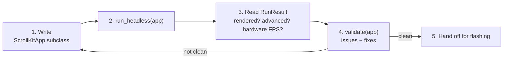

# AGENTS.md — Building ScrollKit LED apps with an AI agent

This is the entry doc for an AI agent (or a human) writing a **ScrollKit** app: a
scrolling LED-matrix display that runs unchanged on the **Adafruit MatrixPortal
S3** (CircuitPython) and on the desktop **pygame simulator**.

The whole point of the workflow below is to close the gap that bites everyone:
*the simulator runs at full desktop speed and looks fantastic, but the real
device is ~100× slower and RAM-tiny, so apps that look great in the sim can crawl
or fail on hardware.* ScrollKit lets you discover that **in the simulator,
headless, before flashing** — so you can iterate without a human and without a
board.

> Repo-specific rules (don't touch `boot.py`/`code.py`, keep code under `/src`,
> CircuitPython compatibility) live in **CLAUDE.md** — read it too if you're
> editing this repository. This file is about *authoring ScrollKit apps*.

---

## The loop

1. **Write** a `ScrollKitApp` subclass (imperative Python — no config/DSL).
2. **Run it headless**: `scrollkit.dev.run_headless(app, frames=N, screenshot=...)`.
3. **Read** the `RunResult`: did it render? did it advance? would it run on
   hardware (estimated FPS + warnings)?
4. **Validate**: `scrollkit.dev.validate(app)` for structured issues + fixes.
5. **Iterate** until the result is clean, then hand off for flashing.



Everything in step 2-4 is **desktop-only** (`scrollkit.dev` raises `ImportError`
on CircuitPython by design — it pulls in numpy/pygame). The app you write in
step 1 runs on both.

### Running things

The repo's root `code.py` shadows the stdlib `code` module, so run tests/scripts
with:

```bash
PYTHONSAFEPATH=1 PYTHONPATH=src python your_script.py
```

The harness sets `SDL_VIDEODRIVER=dummy` itself, so no window is needed.

---

## A minimal working app

```python
from scrollkit.app.base import ScrollKitApp
from scrollkit.display.content import ScrollingText


class HelloApp(ScrollKitApp):
    def __init__(self):
        super().__init__(enable_web=False, update_interval=10)

    async def create_display(self):
        from scrollkit.display.simulator import SimulatorDisplay
        return SimulatorDisplay(width=64, height=32)

    async def setup(self):
        # Add content to the queue; the display loop renders it.
        self.content_queue.add(ScrollingText("HELLO HARDWARE", y=12, color=0x00FF88))
```

Verify it:

```python
from scrollkit.dev import run_headless

result = run_headless(HelloApp(), frames=120, screenshot="frame.png")
print(result.as_text())
```

`run_headless` drives the app's real display loop deterministically (exactly `N`
frames, no inter-frame sleep — same app + same `frames` → same pixels), saves a
PNG, and returns a JSON-able `RunResult`.

---

## The panel and colors

- **Panel:** 64 × 32 pixels (the MatrixPortal S3 standard). `x` is 0-63, `y` is
  0-31. `y=12` vertically centers an ~8px-tall font.
- **Color:** a 24-bit RGB int `0xRRGGBB` (e.g. `0xFF8800`) **or** an `(r, g, b)`
  tuple with each channel 0-255. **Color name *strings* do not work** with the
  content classes below — they'd crash `draw_text`. (Only `MinimalLEDApp`
  understands names.) To use a name programmatically:
  `scrollkit.dev.capabilities()["named_colors"]["orange"]`.

## Content types

Discover these (and their exact parameters) at runtime with
`scrollkit.dev.capabilities()` — it's introspected from the live code so it can't
go stale. The two you'll use most:

- `ScrollingText(text, x=None, y=0, color=0xFFFFFF, speed=30, priority=2,
  palette=None, direction="vertical", palette_steps=8)` — scrolls right-to-left;
  ideal for anything wider than 64px.
- `StaticText(text, x=0, y=0, color=0xFFFFFF, duration=None, priority=2,
  palette=None, direction="vertical", palette_steps=8)` — fixed; keep it short
  enough to fit 64px (≈10 chars) or it'll be clipped.

**Gradient fill:** pass `palette` to either class for a static gradient in the
normal font instead of a flat `color` — two stops `(0xA0E8FF, 0x206080)` for a
simple gradient, three+ for multi-stop, or `depth_palette(color)`
(`scrollkit.display.colors`) to derive a subtle close ramp from one base colour.
`direction` is `"vertical"` (default, reads as depth) / `"horizontal"` /
`"diagonal"`; reverse by reversing the palette. When `palette` is set, `color` is
ignored. Static fill, zero per-frame cost — for *animated* colour use `BitmapText`
+ a `palette_effect`. Details at `capabilities()["text_fills"]`; colour generators
(`gradient`/`multi_gradient`/`depth_palette`/`hsv`/`spectrum`) at
`capabilities()["color_utilities"]`. The panel is RGB444, so keep gradient stops
far enough apart to survive quantization (the simulator previews finer).

**Coordinates:** the origin `(0, 0)` is the **top-left** corner. X grows to the
**right**, Y grows **downward** (standard CircuitPython `displayio`). `y` sets the
text **baseline**, not the top of the glyphs — so `y=0` pushes a line's ascenders
off the top of the panel and renders nothing readable. For the standard 8px font
on the 64×32 panel, `y≈12` vertically centers a single line; valid `y` runs
`0..31`. (Available as `capabilities()["panel"]["coordinates"]`.)

Add content in `setup()` via `self.content_queue.add(...)`. Queue items can carry
a `priority` (see `capabilities()["priorities"]`: IDLE=0 … SYSTEM=5).

---

## Reading the RunResult

`run_headless(...)` returns a `RunResult`. Key fields:

| field | meaning |
|---|---|
| `frames` | frames actually rendered |
| `is_blank` / `bright_pixels` / `coverage` | did anything light up, and how much |
| `advanced` | did the picture change between the first and last frame (e.g. text scrolled) |
| `current_content` | a `describe()` of what was on screen (text, position, …) |
| `estimated_hardware_fps` | modeled FPS on the real device (see below) |
| `hardware` | full feasibility dict; `hardware_text` is the printable version |
| `memory` | estimated free RAM (modeled when hardware timing is on) |
| `errors` / `warnings` | anything that went wrong / advisories |
| `ok` | rendered something with no errors |

`result.advanced is False` for a deliberately static display is fine; for a
`ScrollingText` it means the loop didn't iterate — investigate.

---

## Hardware feasibility — the part that matters

When `hardware=True` (the default), the result includes a report of how the app
would run on the real MatrixPortal S3. The shipped profile is **calibrated from
real measurements** captured on an `adafruit_matrixportal_s3` (CircuitPython
9.1.0), so the report reads `MEASURED on device`:

```
=== Hardware feasibility: Adafruit MatrixPortal S3 (64x32) ===
  Confidence: MEASURED on device (measured on adafruit_matrixportal_s3, CircuitPython 9.1.0)
  Estimated hardware FPS: ~45.1   (median frame ~22 ms, worst ~23 ms)
  Per-frame cost (avg): refresh 13.7 ms | bitmap_rebuild 7.3 ms | ...
  Estimated peak RAM: 1 KB / 1513 KB budget
  No feasibility warnings.
```

(If the baseline file is absent, it falls back to a clearly-labeled ROUGH
ESTIMATE and rounds FPS to one significant figure.)

How to read it:

- **Every frame pays one `display.refresh()` (~13.7 ms measured).** That's a hard
  ceiling near ~73 FPS no matter how simple the app — refresh dominates light
  apps.
- **The #1 rule on top of that: don't rebuild text every frame.** Re-running
  `draw_text` with changing text rebuilds a glyph bitmap pixel-by-pixel in Python.
  A `ScrollingText` that just moves is cheap; redrawing ~12 changing fields per
  frame stacks ~12 rebuilds on top of the refresh and drops you toward single
  digits. If you see the "cache the Label" warning on a busy app, only change
  `.text` when the value actually changes.
- **RAM is rarely the limit on the S3.** ~1.5 MB is free to an app (the ESP32-S3
  PSRAM), so the web server (~50 KB) and data updates (~20-30 KB) fit easily; the
  report still warns if estimated peak RAM ever approaches budget.

A quick contrast you can reproduce: a single `ScrollingText` is refresh-bound at
~45 FPS; an app that redraws ~12 text fields every frame drops to ~13 FPS (and a
heavier one into single digits, with a "scrolling will stutter" warning) —
**even though both look identical in the simulator.** That's the signal to act on
before flashing.

### Feel it: visceral throttle mode

Numbers are easy to ignore. To watch the simulator window actually **crawl at the
modeled hardware speed**, build the display with `throttle=True`:

```python
SimulatorDisplay(width=64, height=32, throttle=True)   # implies hardware timing
```

or set `SCROLLKIT_HW_THROTTLE=1` in the environment for any simulator run. In this
mode each frame sleeps its modeled time and you'll see periodic console nags like
`[hw-sim] frame 30: ~150 ms/frame (~6 FPS) on the real device — this would
stutter.` This is a **live/interactive** aid — the headless `run_headless`
harness always runs unthrottled and silent, so verification stays fast and
deterministic.

---

## Performance cheat-sheet (measured on the device)

`scrollkit.dev.performance_guide()` returns these numbers (captured by a
microbenchmark suite on a real MatrixPortal S3, so they don't drift). The spread
is huge, and it's all about **C calls vs interpreted Python**:

| writing one pixel | ns/pixel | |
|---|---|---|
| `bitmap[x,y] = 1` (interpreted) | ~7,000 | the trap |
| `bitmaptools.blit` (C) | ~620 | ~11× faster |
| `bitmap.fill` (C) | ~4.4 | ~1,600× faster |

| full `display.refresh()` | time | FPS ceiling |
|---|---|---|
| bit_depth ≤ 4 | ~4.5 ms | ~220 |
| bit_depth 6 | ~13.7 ms | ~73 |

The cardinal rules that follow from the data:

1. **Reuse a `Label`; change `.text` only when the value changes.** A text change
   rebuilds the glyph bitmap pixel-by-pixel — the dominant per-frame cost. For
   scrolling, move `.x` and leave `.text` alone. (The library's `UnifiedDisplay`
   now does this for you via a per-frame label pool — don't allocate your own
   Label every frame.)
2. **Never push pixels in a Python loop** — use `bitmap.fill` / `bitmaptools.blit`.
3. **Keep `bit_depth=4`** unless you need smooth gradients (it's ~3× faster than 6).
   `UnifiedDisplay(bit_depth=...)` exposes it; 4 is the default.
4. **Don't allocate per frame** (Label/Bitmap/TileGrid/Group) — tens of µs each,
   plus GC pressure. Create once, mutate.
5. **Heavy compute competes with rendering** — it's cooperative (~500k Python
   ops/sec, no background thread), so a 1,000-op calc costs ~1.5 ms of your frame.
   Chunk long work across frames (and across the synchronous HTTP fetch).
6. **`SwarmReveal` (boids splash): keep `num_birds ≤ ~20` on-device.** Per-frame
   cost grows ~`num_birds²` (the neighbor pass). Measured on an S3 (incl. refresh):
   **14 → ~25 ms** (the default, safe) · 20 → ~34 ms · 28 → ~48 ms (the 20 fps
   limit) · 40 → ~95 ms · **100 → ~0.6 s/frame (unusable)**. Fewer birds also flock
   more visibly. The desktop simulator has no such limit.

## Pre-flight validation

```python
from scrollkit.dev import validate

report = validate(app)          # runs headless once, then checks
print(report.as_text())
print(report.ok)                # False if there are any errors
```

`validate()` returns structured `Issue`s (each has `severity`, `code`, `message`,
`fix`) covering: out-of-range RGB, color *name strings* (an error — they crash),
text wider than the panel (clipped), off-panel `y`, a blank render, runtime
exceptions, and the hardware stutter/RAM warnings. Treat `errors` as blockers and
`warnings` as "this will look/run worse on hardware than in the sim."

---

## Discovering the API

```python
from scrollkit.dev import capabilities, as_text
cat = capabilities()            # JSON-able dict, introspected from live code
# cat["content_types"], cat["priorities"], cat["effects"],
# cat["transitions"], cat["scrolling"], cat["palette_effects"],
# cat["named_colors"], cat["display_api"], cat["hardware"]
print(as_text(cat))             # compact human/agent-readable summary
```

Prefer `capabilities()` over guessing class/parameter names — it reflects the
installed library exactly (and can't drift from prose docs).

### Effects & transitions: one call per category, then verify

There are three SEPARATE categories, applied three different ways — keep them
separate. Call **one function per category** to get what's available (each reads the
live tags, so a new effect added to the library appears automatically):

```python
from scrollkit.effects.transitions import transitions_for
from scrollkit.effects.scrolling import scrollers_for
from scrollkit.display.bitmap_text import palette_effects_for, BitmapText

transitions_for()                 # transition NAMES (all full-screen swaps between screens)
scrollers_for("scrolling")        # scroller CLASSES for scrolling text (KineticMarquee, WaveRider)
palette_effects_for("scrolling")  # palette CLASSES (Rainbow/Mono/Neon/Chrome/Hazard) for BitmapText; most take a base color=
```

Pass `"scrolling"` or `"static"` to `scrollers_for` / `palette_effects_for` to pick by
how the content is presented. (`transitions_for` takes `presentation="fullscreen"`, its
default — transitions are all full-screen swaps, so it returns every one.) Apply each by
its category — they are NOT interchangeable:

```python
import random
# a transition fires BETWEEN screens — it's a setting:
app.settings.set("transition_style", random.choice(transitions_for()))
# a scroller IS the content — add the class to the queue:
cls = random.choice(scrollers_for("scrolling"))
app.content_queue.add(cls("Space Mountain  45 min", y=12))
# a palette effect goes ON bitmap text:
pe = random.choice(palette_effects_for("scrolling"))
app.content_queue.add(BitmapText("OPEN", palette_effect=pe()))
```

> **Queueing `BitmapText`:** by default it's a *persistent banner* (`is_complete`
> is always False), so a `ContentQueue` never advances past it. Pass
> `complete_after_passes=N` to make it finish after the text has fully scrolled
> across `N` times: `BitmapText("NOW OPEN", complete_after_passes=1)`. Completion is
> keyed on scroll **position**, not wall-clock, so a slow frame rate can't cut the
> text off mid-scroll. (See `docs/guide/bitmap-text.md`.)

Then **verify every change** with `run_headless(app, strict=True)` — an effect that
busts the ~50 ms / 20 fps budget raises `FeasibilityError`. (The raw tags are also in
`cat["transitions"]` / `cat["scrolling"]` / `cat["palette_effects"]` as `pairs_with`;
the full pairing table is in `docs/guide/effects.md`.)

---

## Recording video & animated GIFs

**ScrollKit records the simulator for you — do not write your own capture code.**
There is a built-in, calibrated recorder that emits PNG, animated GIF, and MP4
(H.264). It produced the `scrollkit.dev` landing-page hero video and every Demo
Gallery GIF. If you're asked to make a video, GIF, preview, or screenshot, use the
API here — **don't** add a dependency, a new recorder module, a separate pygame
frame loop, or a parallel ffmpeg pipeline. It's all desktop-only and a safe no-op
(returns `None`) on hardware.

### The easy way: record a whole app headlessly

```python
from scrollkit.dev import record_gif, record_video

record_gif(MyApp(),   "preview.gif", seconds=4)              # animated GIF
record_video(MyApp(), "hero.mp4",    seconds=6, border=22)   # MP4 / H.264
```

Both render the app's real display loop headlessly (deterministically, at the
harness's 20 FPS — so `seconds` × 20 = frames captured) and return the saved path
(or `None` if recording isn't available). Extra keyword args are forwarded to the
encoder (see the tuning knobs below). The same thing via the general harness:

```python
from scrollkit.dev import run_headless

r = run_headless(MyApp(), seconds=4, gif="preview.gif",
                 gif_opts={"target_width": 320, "max_colors": 48, "frame_step": 2})
print(r.gif)          # saved path; r.video / r.screenshot for the other outputs

run_headless(MyApp(), seconds=6, video="hero.mp4", video_opts={"crf": 20, "border": 22})
```

> **GIF and MP4 are mutually exclusive in a single `run_headless` call** — the
> recorded frame buffer is consumed by the first save. Make two calls (or use the
> `record_*` helpers) if you want both.

### The manual way: capture frames you render yourself

When you're driving a `SimulatorDisplay` directly (not a whole app), record off it:

```python
display.start_recording()         # begin capturing every shown frame
for _ in range(80):
    await content.render(display)
    await display.show()          # each shown frame is captured
display.save_gif("out.gif")       # encode + clear the buffer (or .save_video("out.mp4"))
display.screenshot("frame.png")   # one-off: just the current frame, no recording
```

### Tuning the output

| knob | where | effect |
|---|---|---|
| `seconds` / `frames` | `run_headless` / `record_*` | duration; harness runs at 20 FPS (`seconds × 20 = frames`) |
| `pitch` | `SimulatorDisplay(pitch=…)` | render resolution. Default `3.0`; raise it for crisp output (Demo GIFs use `4.0`, the hero uses `6.0`). Logical grid stays 64×32. |
| `fps` | `save_gif` / `save_video` | playback frame rate of the encoded file (GIF default 20, MP4 default 24) — separate from the capture rate |
| `target_width` | both | downscale width (GIF default 360; MP4 `None` = native) |
| `max_colors`, `frame_step` | `save_gif` | GIF palette size (default 48) and "keep every Nth frame" for smaller files (default 1) |
| `crf`, `preset`, `border` | `save_video` | MP4 quality (≈18 best … 24 smaller; 20 default), x264 speed preset, and a dark bezel of N px |

### Dependencies & ready-made generators

GIF needs **Pillow**, MP4 needs a system **`ffmpeg`** on PATH (`brew install
ffmpeg`); both need pygame + numpy. Pillow/pygame/numpy ship in the `[simulator]`
extra (`pip install scrollkit[simulator]`); ffmpeg is a separate system install.

Don't reinvent the batch generators either — reuse or extend these:

- `make docs-gifs` (or `PYTHONSAFEPATH=1 PYTHONPATH=src python demos/render_gifs.py`)
  — regenerates every Demo Gallery GIF into `docs/assets/demos/`.
- `make hero` (`demos/render_hero.py`) — the landing-page hero MP4 + GIF + poster
  PNG into `docs/assets/video/`.

## Reliability & device lifecycle (on the real board)

The simulator can't exercise these — they only do something on hardware — but a
shipping app wants them. All are opt-in and degrade to no-ops on desktop.

- **Watchdog + crash diagnostics.** Construct with `ScrollKitApp(enable_watchdog=True)`
  so a wedged display loop self-resets, and pair it with NVM diagnostics to survive
  and explain a crash:

  ```python
  from scrollkit.utils import diagnostics
  diag = diagnostics.open()                          # NVM on device, no-op on desktop
  diag.record_boot(diagnostics.read_reset_reason())
  if diag.safe_mode:                                 # too many fault-reboots in a row
      ...                                            # skip the fetch; keep the config UI up
  diag.note_fetch_result(ok=True)                    # on a healthy refresh
  ```

  The record lives in `microcontroller.nvm` (survives power loss, unlike a flash log
  a crash can wipe); after a few fault-reboots with no clean run it trips *safe mode*
  to break a deterministic boot loop. See `docs/guide/app.md`.

- **Pause rendering during a blocking update.** A synchronous fetch freezes the loop,
  so paint a status frame and suspend the queue (it's preserved — a failed fetch
  resumes the last-good content, never a black panel):

  ```python
  async def update_data(self):
      with self.suspended_render():       # always resumes, even on exception
          await self.paint_status_frame("Updating")
          ok = await self.fetch()
  ```

- **mDNS** — reach the device by name: `mdns.advertise("myhost")` (returns the
  server, which you MUST keep a reference to). `from scrollkit.network import mdns`.

- **OTA install UI** — wrap a headless `OTAClient` to get progress frames + the
  staged-install flow: `OTAProgressDisplay(client, display)` →
  `await ota.install_pending()`. `from scrollkit.ota.display_progress import OTAProgressDisplay`.

(Full signatures: `docs/reference.md`; rationale + caveats: the `docs/guide/` pages.)

## CircuitPython gotchas (for the app you ship)

The app runs on CircuitPython, a subset of MicroPython. In app code: no `typing`
at runtime, catch `ValueError` (not `JSONDecodeError`) and `OSError` (not
`FileNotFoundError`), use `time.monotonic()` (not `time.time()`), cooperative
`asyncio` only (no threads), and remember HTTP (`adafruit_requests`) is
**synchronous** — a fetch pauses the display loop, so break long work into chunks
and show a "loading" frame. See CLAUDE.md for the full list.
