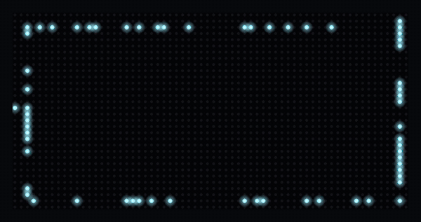

# ScrollKit

LED Matrix Display Framework for CircuitPython and Desktop.

Build applications that run on CircuitPython HUB75 boards (the Adafruit MatrixPortal S3 and the Pimoroni Interstate 75 W) and a desktop simulator — write once, test everywhere.

<p align="center">
  
</p>

## Installation

```bash
# Desktop development with simulator
pip install scrollkit[simulator]

# CircuitPython — copy scrollkit/ to your device's lib/ alongside your source
```

## Quick Start

```python
from scrollkit.app.minimal import MinimalLEDApp

app = MinimalLEDApp()                       # auto-detects MatrixPortal hardware vs desktop simulator
app.scroll_text("Hello, LED Matrix!", color="cyan")
```

> The top-level `scrollkit` package deliberately performs **no** imports (every
> import costs RAM on CircuitPython), so you always import from submodules — e.g.
> `from scrollkit.app.minimal import MinimalLEDApp`. See the
> [getting-started guide](https://github.com/czei/scrollkit/blob/master/docs/getting-started.md)
> for the full `ScrollKitApp` / `UnifiedDisplay` API.

## Package Structure

```
scrollkit/
├── display/          # Display abstraction layer
│   ├── display_interface.py     # Abstract base class
│   ├── generic_display.py       # Cross-platform rendering engine
│   ├── display_factory.py       # Platform-aware display creation
│   ├── message_queue.py         # Generic message queuing
│   ├── roller_coaster_animation.py
│   └── roller_coaster_animation_cp.py
├── network/          # Networking utilities
│   ├── http_client.py           # Dual-implementation HTTP client
│   ├── wifi_manager.py          # WiFi configuration and management
│   ├── mdns.py                  # <hostname>.local advertising (CircuitPython; no-op on desktop)
│   ├── server_adapters.py       # Platform-specific HTTP servers
│   ├── async_http_request.py    # Low-level async HTTP
│   └── http_response_patch.py   # Connection error handling
├── config/           # Configuration management
│   └── settings_manager.py      # JSON-based persistent settings
├── ota/              # Over-the-air updates
│   ├── ota_updater.py           # GitHub release-based OTA
│   └── display_progress.py      # Display-progress + staged-install adapter over OTAClient
└── utils/            # Utilities
    ├── error_handler.py         # Logging and error handling
    ├── diagnostics.py           # NVM boot/crash record + reboot-loop safe-mode breaker
    ├── color_utils.py           # Color conversion and manipulation
    ├── timer.py                 # Simple elapsed-time timer
    ├── system_utils.py          # NTP clock synchronization
    ├── url_utils.py             # URL decoding and credential loading
    └── image_processor.py       # Bitmap image utilities
```

## Core API

### Display

```python
from scrollkit import GenericDisplay, MessageQueue

# Platform detection
from scrollkit import is_circuitpython, is_dev_mode

# Create display (auto-detects CircuitPython vs desktop)
display = GenericDisplay()
display.initialize()

# Basic operations
display.show_scroll_message("Scrolling text")
display.show_static_text("Hello", x=0, y=15)
display.show_image(pil_image, x=0, y=0)
display.set_brightness(0.5)
display.clear()

# Custom layouts
label = display.create_label("Custom", x=2, y=10, scale=2, color=0xffaa00)
group = display.create_group(label)
display.add_to_main_group(group)

# Message queuing
queue = MessageQueue(display)
queue.add_message(display.show_scroll_message, "Message 1")
queue.add_message(display.show_scroll_message, "Message 2")
await queue.show()
```

### HTTP Client

```python
from scrollkit import HttpClient

client = HttpClient()
response = await client.get("https://api.example.com/data")
data = response.json()
```

### Settings

```python
from scrollkit import SettingsManager

settings = SettingsManager("app_settings.json",
    defaults={"hostname": "mydevice", "brightness": "0.5"},
    bool_keys=["dark_mode"])
settings.set("hostname", "new-name")
settings.save_settings()
```

### Utilities

```python
from scrollkit import ErrorHandler, Timer
from scrollkit.utils.color_utils import ColorUtils

logger = ErrorHandler("app.log")
logger.info("Application started")

timer = Timer(300)  # 5 minutes
if timer.finished():
    timer.reset()

color = ColorUtils.scale_color(0xff0000, 0.5)  # Dim red to 50%
```

## Platform Support

| Platform | Backend | Status |
|---|---|---|
| Adafruit MatrixPortal S3 | CircuitPython + displayio | ✅ Calibrated from device |
| Pimoroni Interstate 75 W (RP2350) | CircuitPython + rgbmatrix | ✅ Supported (perf profile uncalibrated) |
| Desktop (macOS/Linux/Windows) | SLDK Simulator | ✅ |
| Custom CircuitPython boards | displayio / rgbmatrix | 🔌 Extensible (see docs: Adding New Hardware) |

## License

MIT