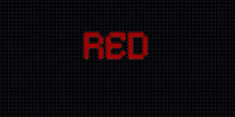
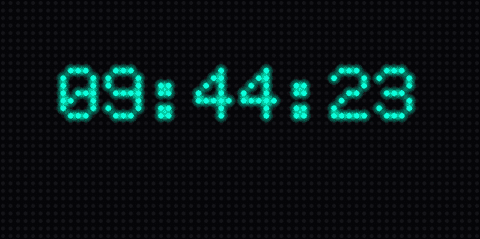
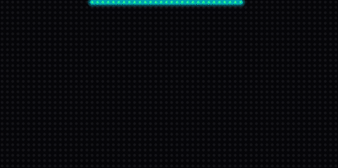
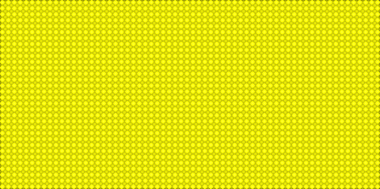
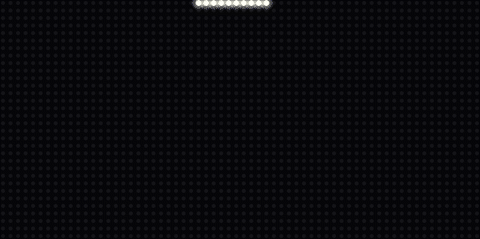
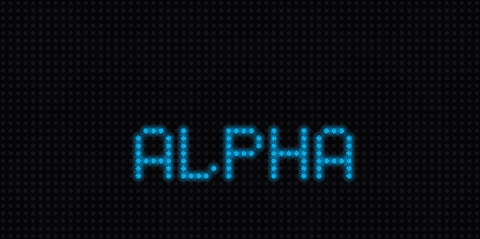
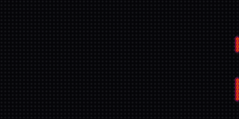
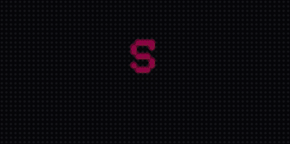
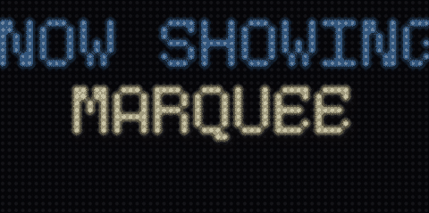
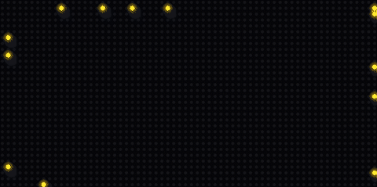

# Demo Gallery

Every demo below runs on the desktop simulator — **no hardware required**. The
animations are recorded straight from that simulator (the same `SimulatorDisplay`
your own app uses), so they show exactly what you'll see on screen. The identical
code runs unchanged on a CircuitPython HUB75 board.

Run any demo from the repo root:

```bash
PYTHONPATH=src python demos/<tier>/<name>.py
```

!!! note "Live-data demos"
    `temperature` and `crypto_dashboard` fetch from public APIs when you run them.
    The previews here were recorded with representative sample data so the display
    is populated rather than showing a "loading…" frame.

## Easy

### Hello World

{ width="480" }

The simplest possible app: scroll a greeting across the matrix. No network.
`demos/easy/hello_world.py` — walked through in the [Easy tutorial](tutorials/easy.md).

### Colors

{ width="480" }

A centered word cycling through the rainbow, switching every ~1.5 s. No network.
`demos/easy/colors.py`

### Clock

{ width="480" }

A digital `HH:MM:SS` clock updating every second. No network.
`demos/easy/clock.py`

### Drip Splash

{ width="480" }

Every logo LED appears at the top of its column and falls into place, assembling
the text drop by drop. `demos/easy/drip_splash.py`

### Reveal Splash

{ width="480" }

All LEDs light, then wink off at random until only the logo remains.
`demos/easy/reveal_splash.py`

## Medium

### Configurable Message

{ width="480" }

A browser-configurable scrolling message — edit it live in the auto-generated
settings web UI and the display updates on save. `demos/medium/configurable_message.py`

### Drip Value

{ width="480" }

A large number drips into place, holds, then a fresh value drips in — the pattern
for a live metric like a wait time. `demos/medium/drip_value.py`

### Golden Transition

{ width="480" }

The annotated reference for writing your own content-swap `Transition`, gated by
the hardware-feasibility budget. `demos/medium/golden_transition.py` — see the
[Transitions guide](guide/transitions.md).

### Big Rainbow

{ width="480" }

A tall custom BDF font scrolled with a per-letter rainbow that fills the panel
height. `demos/medium/rainbow.py`

### Temperature

{ width="480" }

Live temperature from the open-meteo public API (no key), scrolled and refreshed
every 5 minutes. `demos/medium/temperature.py` — the [Medium tutorial](tutorials/medium.md).

## Hard

### Crypto Dashboard

{ width="480" }

The showpiece: a full multi-row live dashboard — rainbow title, live weather, a
rotating coin, and a scrolling price ticker — fed by two no-key APIs with chunked
fetch, web config, and OTA. `demos/hard/crypto_dashboard.py` — the
[Hard tutorial](tutorials/hard.md).

### Showcase

{ width="480" }

A scripted reel that announces and demonstrates every signature effect:
characterful scrolls, theatrical transitions, and palette-animated bitmap text.
`demos/hard/showcase.py` — see the [Effects guide](guide/effects.md).

### Swarm Reveal

{ width="480" }

A flock of boids flies in, each bird delivering its target pixel to assemble the
logo, then disperses. `demos/hard/swarm_reveal.py`
