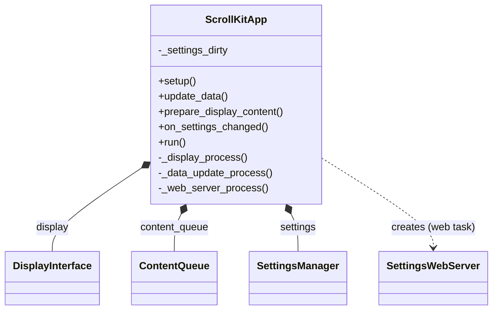
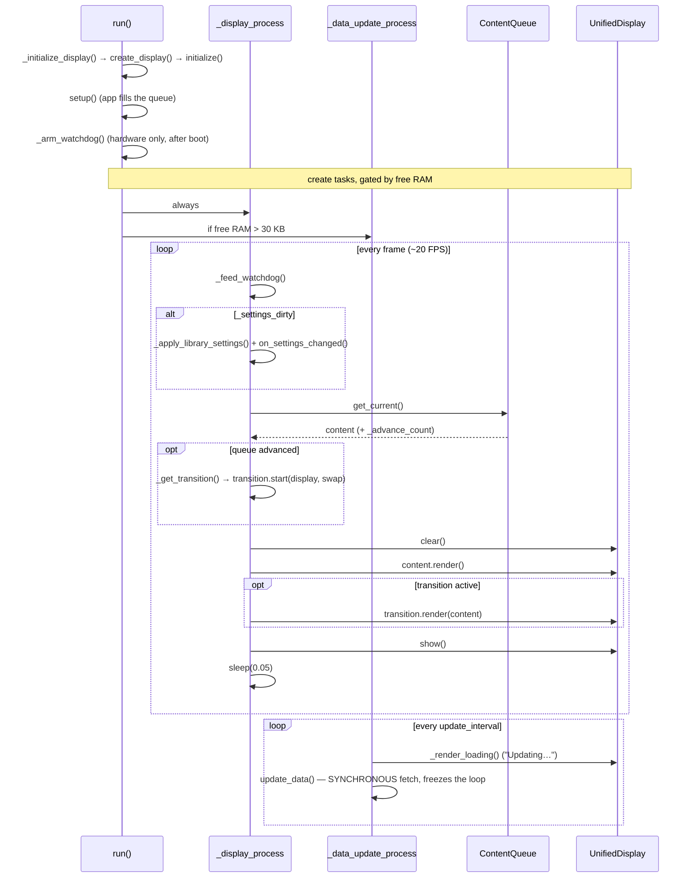

# App Framework

`scrollkit.app.base.ScrollKitApp` is the entry point for building applications.

## ScrollKitApp

`scrollkit.app.base.ScrollKitApp` — the full-featured async base class. Subclass
it and override the hooks you need.

```python
class MyApp(ScrollKitApp):
    def __init__(self):
        super().__init__(enable_web=True, update_interval=300)

    async def setup(self):            # once, at startup
        ...
    async def update_data(self):      # every update_interval seconds
        ...
    async def prepare_display_content(self):   # each display frame
        return await self.content_queue.get_current()   # default behaviour
```

### What a ScrollKitApp owns

The base class composes the three things every app needs — a display, a content
queue, and settings — and it creates the web server lazily when memory allows. It
deliberately does **not** own networking or OTA: apps construct those and drive
them from `setup()` / `update_data()` (see [Networking](networking.md) and
[OTA Updates](ota.md)).

<!-- Source: app/base.py (create_display, content_queue, settings, create_web_server) -->


(`ScrollKitApp` is the public name; `SLDKApp` is a backward-compatible alias.)

### Three-process architecture

`run()` launches up to three cooperative async tasks, gated by available RAM:

| Process | Runs when | Job |
|---------|-----------|-----|
| **Display** | always | render content at ~20 FPS |
| **Data update** | ≥ ~30 KB free | call `update_data()` every `update_interval` |
| **Web server** | `enable_web` and ≥ ~50 KB free | serve the config UI |

On low-memory devices the data and web processes are skipped automatically so
the display always keeps running — graceful degradation rather than a crash.

!!! note "Naming"
    `ScrollKitApp` is the public name; `SLDKApp` remains as a backward-compatible
    alias.

## The run loop

`run()` initializes the display, calls your `setup()`, arms the watchdog, then
spawns the memory-gated tasks. The display loop is the device's heartbeat: it
feeds the watchdog, applies any pending settings save, pulls the current queue
item, fires a transition when the queue advances, renders, and paces itself to
~20 FPS. A data fetch is **synchronous**, so while `update_data()` runs it freezes
this entire loop — which is why the data task paints a loading frame first.

<!-- Source: app/base.py (run, _display_process, _data_update_process), display/content.py (get_current, _advance_count) -->


## Pausing the display during a blocking update

`update_data()` often paints an off-queue status frame ("Updating…") and then makes
a blocking fetch. Because the synchronous fetch freezes the loop, the *previous*
queue item can ghost over the status frame. Suspend rendering for that window — the
queue keeps its items, so a **failed** fetch resumes the last-good content instead
of going black:

```python
async def update_data(self):
    with self.suspended_render():          # always resumes, even on exception
        await self._teardown_active_content()
        await self.paint_status_frame("Updating")
        ok = await self.fetch()            # loop frozen anyway → no ghosting
```

`suspend_render()` / `resume_render()` and the `render_suspended` property are also
available if you can't use the context manager. While suspended the base
`prepare_display_content()` returns `None`, so you no longer override it just to gate
rendering. Default is **not** suspended.

## Reliability: watchdog + NVM diagnostics

Pair the hardware watchdog (`enable_watchdog=True`) with
[`scrollkit.utils.diagnostics`](../reference.md#network--config--utils) for a device
that self-heals and can explain itself:

```python
from scrollkit.utils import diagnostics

diag = diagnostics.open()                       # NVM on device, no-op on desktop
diag.record_boot(diagnostics.read_reset_reason())
if diag.safe_mode:                              # too many fault-reboots in a row
    ...                                         # skip the fetch; keep the config UI up
diag.note_fetch_result(ok=True)                 # on a healthy refresh
```

The record lives in `microcontroller.nvm`, so it survives both soft resets and power
loss (unlike a flash log a crash can wipe). After `RAPID_BOOT_LIMIT` fault-reboots
with no clean run it trips **safe mode** — break a deterministic boot loop instead of
resetting forever — and it keeps the last reset reason + exception text for a config
page post-mortem.
