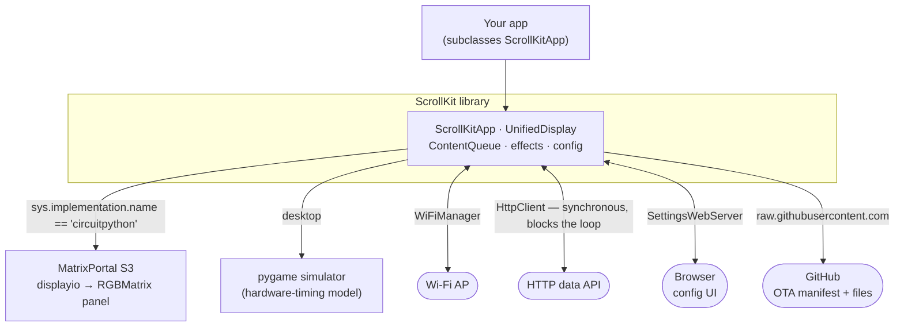
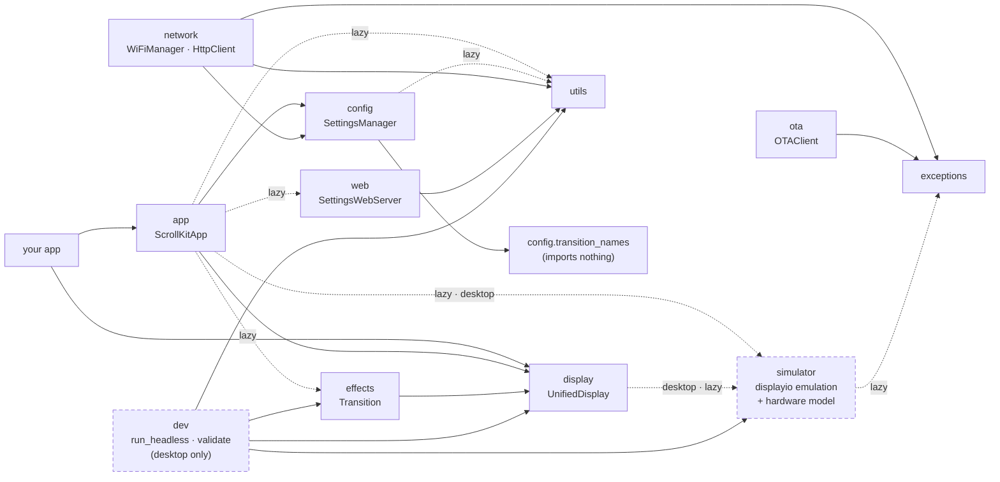

<!--
  Architecture overview. Diagrams are sourced from live code — re-verify against:
  A (system context): app/base.py, display/unified.py, network/, ota/client.py
  B (module graph):    imports across src/scrollkit/*/  (see the per-edge notes)
-->
# Architecture

ScrollKit is one library that runs **unchanged** on the Adafruit MatrixPortal S3
(CircuitPython) and on a desktop pygame simulator. This page shows how the pieces
fit together — from where the library sits in a running device down to the
subsystem dependencies. For class-level detail, follow the links to each guide.

## System context

Your application subclasses [`ScrollKitApp`](app.md) and talks to a single
display abstraction, [`UnifiedDisplay`](display.md). The library picks its backend
at import time and brokers every external system the sign touches:

The one detail that shapes everything else: **HTTP is synchronous**
(`adafruit_requests`), so a data fetch blocks the whole cooperative event loop —
including rendering. The library paints a loading frame and suspends rendering
around the blocking call, and — when the app opts in (`enable_watchdog=True`) —
the hardware watchdog resets the board if a fetch truly wedges. See
[Performance](performance.md) and the [run loop](app.md#the-run-loop) for how
that plays out frame-by-frame.

## Subsystem dependencies

Each box is a package under `src/scrollkit/`. Solid arrows are eager (module
top-level) imports; **dashed** arrows are lazy imports done inside a function —
the RAM-saving pattern that keeps the device boot path light. `your app` uses only
`app` and `display`; everything else is an internal or app-wired detail.

Dashed-outlined boxes (`dev`, `simulator`) are **desktop-only** — importing them
on CircuitPython raises `ImportError` by design.

!!! warning "The rules this graph enforces"
    These invariants are load-bearing on a RAM-constrained device; a change that
    breaks one is a regression, not a refactor:

    - **The top-level `scrollkit/__init__.py` does no eager submodule imports.**
      Every import costs RAM; the package stays a thin namespace.
    - **Nothing in the core library imports `dev/`.** It pulls in numpy/pygame and
      is verification-only.
    - **`config`/settings never imports `effects/`.** `config.transition_names`
      imports *nothing*, so selecting a transition in the settings UI doesn't drag
      the `effects/` package onto the boot path.
    - **`web/` imports only the shared `utils.url_utils.url_decode` helper** —
      its `settings` and `app` are dependency-injected, which is what keeps the
      web server from ever touching display/queue state (see
      [Web Interface](web.md#thread-safety-the-one-channel)).
    - **`app` does not own `network`/`ota`.** Apps construct those themselves and
      call them from `setup()` / `update_data()` (see [Networking](networking.md),
      [OTA Updates](ota.md)).

## Where to go deeper

| Concern | Diagram | Guide |
|---------|---------|-------|
| One display, two backends | class hierarchy + backend selection | [Display](display.md) |
| What you put on screen | content class hierarchy | [Display](display.md#content-class-hierarchy) |
| Content-swap transitions | `Transition` class diagram | [Transitions](transitions.md#the-transition-class-family) |
| The async lifecycle | run-loop sequence | [App Framework](app.md#the-run-loop) |
| Web config safety | settings-handoff sequence | [Web Interface](web.md) |
| Over-the-air updates | OTA flow | [OTA Updates](ota.md) |
| Building & proving an app | verification workflow | [Simulator](simulator.md#the-verification-workflow) |
