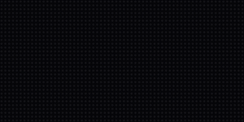
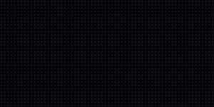
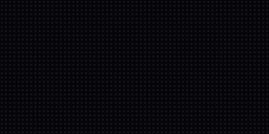
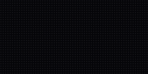
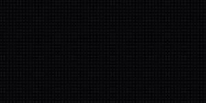

# Character Animation

A scrolling sign gets attention; a sign with an *inhabitant* gets affection.
This guide builds an animated character from nothing but ASCII art and a
handful of integer-math idioms: a sprite drawn as text rows, a two- or
three-pose wing cycle, mirroring for direction changes, eased flight paths,
and props the character can pick up and put down. Everything runs unchanged
on the desktop simulator and a MatrixPortal S3, because per frame it costs
almost nothing — a few TileGrid moves and a pose swap.

The worked example is the [Showcase Reel](../demos.md#showcase-reel) demo
(`demos/hard/showcase_reel.py`), whose flying owl and zigzag bee cross the
panel between acts. The owl art is borrowed from the DarkOwl desk-sign app
that ScrollKit's palette effects were promoted from; every snippet below is
that demo's real code.

## Draw the sprite as ASCII rows

A sprite is a list of equal-length strings. Each character names a palette
slot, so the art and its coloring stay separate:

```python
SPRITE_CHARS = {".": 0, "#": 1, "o": 2, "w": 3, "d": 4, "h": 5, "b": 6}
SPRITE_COLORS = (
    0x000000,   # 0 transparent
    0xB02318,   # 1 '#' brick red (body base)
    0xFFB030,   # 2 'o' amber (eyes, beak, bee stripes)
    0xFFF1D8,   # 3 'w' warm white (catchlights, wings)
    0x571007,   # 4 'd' dark plumage / bee bands
    0xD4481E,   # 5 'h' hot underside
    0xE8873C,   # 6 'b' tawny buff (facial disc, bee head)
)

# The bee (13x7, facing RIGHT): amber body with hot-orange bands, a white
# eye up front, a tapered tail-stinger, white wings in two poses.
BEE_UP = (
    "....www......",
    "...wwwww.....",
    "....ww.......",
    "...ohhoohhow.",
    "hhoohhoohhoo.",
    "...ohhoohho..",
    ".............",
)
```

Three rules learned the hard way:

- **Slot 0 is transparent.** Call `palette.make_transparent(0)` so the panel
  shows through — a character is a silhouette, not a rectangle.
- **Give characters their own palette.** ScrollKit's palette treatments
  animate by rewriting palette entries; if your sprite shares a palette with
  the content being treated, the effect will recolor your character
  mid-flight. A dedicated palette makes that impossible.
- **Contrast against black, not against paper.** A "black" band on a bee
  works on white paper; on an LED panel it just vanishes. The bee's bands use
  the hot orange (`h`), not the dark shade — dark-on-black disappears.

## Rows → Bitmap → TileGrid

Build each sprite **once** at startup. The conversion is a per-pixel loop, so
it must never run inside the frame loop:

```python
def _build_tile(self, rows):
    h, w = len(rows), len(rows[0])
    bmp = displayio.Bitmap(w, h, len(SPRITE_COLORS))
    for y, row in enumerate(rows):
        for x, ch in enumerate(row):
            slot = SPRITE_CHARS[ch]
            if slot:
                bmp[x, y] = slot
    tile = displayio.TileGrid(bmp, pixel_shader=self._sprite_palette)
    tile.hidden = True
    self.display.add_layer(tile)
    return tile
```

From here on, animating the character means writing `tile.x`, `tile.y`, and
`tile.hidden` — integer attribute writes, effectively free on the device.

## Pose cycling: the flap

A character reads as *alive* the moment its silhouette changes while it
moves. Two poses are enough for a small sprite. Draw the wing up and the wing
down, then alternate every few frames:

```python
def _fly_pose(self, tiles, frame, x, y):
    """Show one wing pose of the flapping owl at (x, y), hide the other."""
    up = (frame // 3) % 2 == 0
    show, hide = (tiles[0], tiles[1]) if up else (tiles[1], tiles[0])
    show.x, show.y = x, y
    show.hidden = False
    hide.hidden = True
```

{ width="300" }

*The small owl's two-pose flap — and note the return trip: that's the same
art mirrored (next section).*

A bigger sprite deserves a real cel cycle. The big owl has three authored
poses — wings UP, MID (glide), DOWN — cycled `UP → MID → DOWN → MID` so the
wing passes through the glide position on both the upstroke and the
downstroke, exactly like a hand-drawn flap:

```python
def _big_pose(self, tiles, frame, x, y):
    """Cel flap for the big owl: UP -> MID -> DOWN -> MID, 2 frames each."""
    pose = (0, 1, 2, 1)[(frame // 2) % 4]
    for i, tile in enumerate(tiles):
        if i == pose:
            tile.x, tile.y = x, y
            tile.hidden = False
        else:
            tile.hidden = True
```

{ width="300" }

*The 24x16 owl's three-pose cel cycle, riding a sine swoop across the panel.*

Every pose is its own prebuilt TileGrid; "changing pose" is two `hidden`
flags. Never rebuild bitmaps to change a frame of animation.

## Mirroring for direction

A character that only ever flies one way feels like a screensaver. Flip the
rows once at startup and build a second set of tiles:

```python
def _mirror(rows):
    """The sprite flipped left-to-right (index loop — CircuitPython has no
    extended slices, so rows[::-1]-style tricks are off the table)."""
    out = []
    for row in rows:
        out.append("".join(row[len(row) - 1 - j] for j in range(len(row))))
    return out

self.fly_left = [self._build_tile(OWL_FLY_UP), self._build_tile(OWL_FLY_DOWN)]
self.fly_right = [self._build_tile(_mirror(OWL_FLY_UP)),
                  self._build_tile(_mirror(OWL_FLY_DOWN))]
```

Note the index loop: **CircuitPython has no extended slices**, so
`row[::-1]` raises on the device even though it works on desktop. The
simulator won't catch this for you — it's real Python.

## Flight paths: easing is the acting

Linear motion reads as robotic. Two cubic easings and a sine are enough to
give a sprite intent:

```python
def _ease_out(t):
    """Cubic ease-out on t in 0..1 (decelerating arrivals)."""
    inv = 1.0 - t
    return 1.0 - inv * inv * inv

def _ease_in(t):
    """Cubic ease-in on t in 0..1 (accelerating departures and dives)."""
    return t * t * t
```

- **Arrivals decelerate** (`_ease_out`): the owl brakes onto its perch.
- **Departures accelerate** (`_ease_in`): it commits and goes.
- **Crossings ride a curve.** The big owl's flyby bends through
  `y = y_base + dip * sin(pi * t)` — one graceful swoop instead of a straight
  line. The bee gets a busier personality from a higher-frequency sine:

```python
x = int(round(-bee_w - 2 + 1.8 * f))            # constant drift...
y = y_base + int(round(5.0 * math.sin(f * 0.30)))   # ...on a nervous zigzag
```

{ width="300" }

*Same two-pose flap idiom as the owl, but the sine path makes it a bee.*

Combine the two easings and you get the most dramatic move a bird knows —
the stoop. Dive on `ease_in` (gravity wins), then climb out on `ease_out`
(momentum spent):

```python
if f <= dive:
    p = f / dive
    y = -4 + 20 * _ease_in(p)        # accelerating dive
else:
    q = (f - dive) / climb
    y = 16 - 22 * _ease_out(q)       # decelerating climb-out
```

{ width="300" }

*An ease-in dive plus an ease-out climb reads as hunting, not commuting.*

## Carrying props

The strongest character beats come from interacting with the content itself.
In the showcase reel's opener the owl air-drops the letters of SCROLLKIT one
by one, then sweeps back later and collects them. The mechanics are three
small ideas:

1. **The prop rides at a fixed offset** from the carrier (the talons), so it
   moves for free while attached.
2. **Release is a position test**: when the talons pass a letter's slot, that
   letter switches from "riding" to "falling".
3. **Gravity is `t * t`**: a quadratic fall from the talon height to the
   letter's resting slot.

```python
owl_center = x + owl_w * 0.35            # where the talons are
for i in range(len(letters)):
    tile, tx, ty, w = letters[i]
    if i not in dropped and owl_center <= tx + w / 2:
        dropped.add(i)                   # release this letter
        falling.append([i, 0])

for item in falling:                     # each falling letter
    i, phase = item
    t = phase / fall_frames
    tile.y = int(round(drop_y + (ty - drop_y) * t * t))   # gravity
```

{ width="300" }

*Props released from the talons as the owl passes each slot. The pickup is
the same loop reversed: letters rise `t * t` back into the claws.*

## Staying inside the hardware budget

The MatrixPortal S3 is ~100x slower than your desktop, with a ~50 ms frame
budget at 20 fps. Character animation as described here fits easily because
of what it *doesn't* do per frame:

| Per frame | Cost |
|---|---|
| `tile.x` / `tile.y` / `tile.hidden` writes | effectively free |
| a pose swap (two `hidden` flags) | effectively free |
| palette writes (colors, blinks) | cheap — no pixel work |
| building a Bitmap / rebuilding art | **never do this per frame** |
| per-pixel Python loops over the panel | **~7 µs per pixel — the trap** |

The rules: build every tile (both directions, all poses) once at scene start;
animate only by moving and hiding them; keep any per-pixel work (the ASCII
conversion) out of the frame loop. The whole showcase reel — characters,
treatments, swarms and all — models at ~120 fps on real S3 measurements with
no feasibility warnings.

Verify your own app the same way:

```bash
SCROLLKIT_HW_SIM=1 python your_app.py      # model device timing in the sim
```

or read `display.feasibility_report()` after a headless run — see the
[Performance guide](performance.md) and the
[Simulator guide](simulator.md) for the full loop.

## See it live

Every clip on this page regenerates from the showcase reel's own sprite code
via `make docs-reference`, and each has a live preview:

```bash
python demos/render_reference.py --preview owl-stoop
python demos/hard/showcase_reel.py           # the whole reel, endlessly
```
