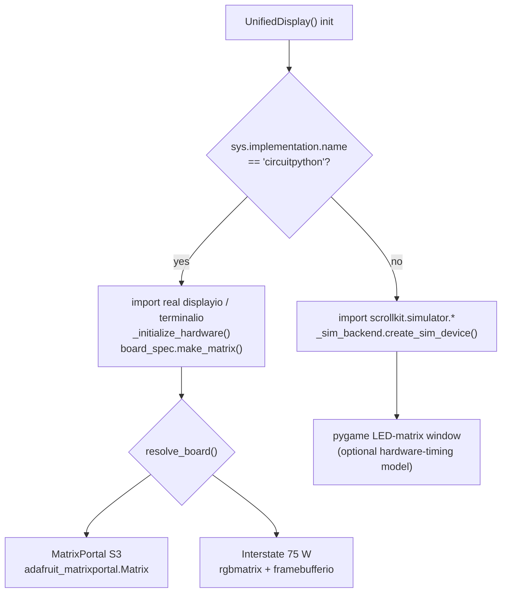
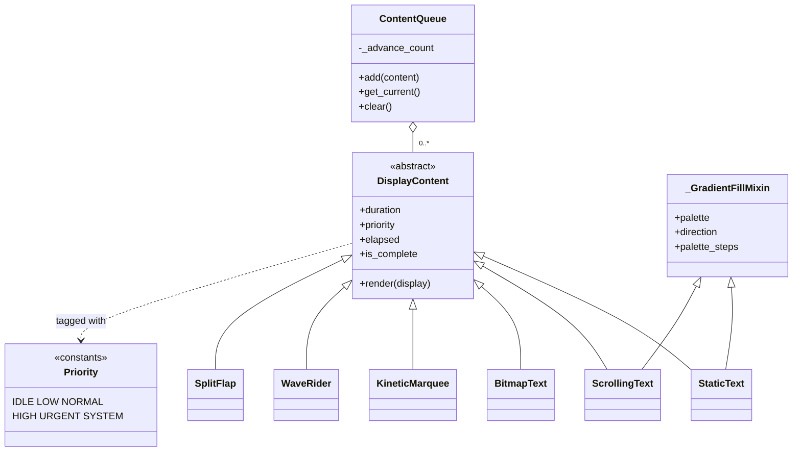

# Display

`scrollkit.display` is the heart of the library: the display abstraction, the
content types, and the content queue.

## UnifiedDisplay

`scrollkit.display.unified.UnifiedDisplay` is **the** display an app uses. It
implements `DisplayInterface` and auto-selects its backend:

- **CircuitPython** → real `displayio` hardware, auto-detecting the board (the
  Adafruit MatrixPortal S3 or the Pimoroni Interstate 75 W). Pass `board="..."`
  to force one. See [Adding New Hardware](hardware.md).
- **Desktop** → the [pygame simulator](simulator.md).

Your app talks to one interface — `set_pixel`, `fill`, `draw_text`, `show`,
`clear`, `set_brightness` — and never branches on platform.

(Recording, `screenshot()`, and the `hardware_timing`/`throttle`/`strict`
feasibility flags all live on `UnifiedDisplay` itself — documented no-ops
returning `None` on real hardware. The desktop-only `SimulatorDisplay`
subclasses `UnifiedDisplay` and only adds an auto-opened window plus
`scale`/`pitch` constructor knobs; it's for tests, demos, and the dev harness —
see [Simulator](simulator.md). Ship apps against `UnifiedDisplay`.)

```python
from scrollkit.display.unified import UnifiedDisplay

display = UnifiedDisplay()      # width == 64, height == 32
await display.initialize()
await display.fill((0, 0, 0))
await display.draw_text("Hi", 0, 12, (0, 255, 128))
await display.show()
```

### Display class hierarchy

Both real displays share one contract (`DisplayInterface`) and one set of C
bulk-painter implementations (`GraphicsMixin`). There is **no separate hardware
subclass** — hardware *is* `UnifiedDisplay` running its CircuitPython branch, with
the Adafruit `RGBMatrix`/`displayio` objects held in `UnifiedDisplay.matrix` /
`.display`.

<!-- Source: display/interface.py, display/_graphics.py, display/unified.py, display/simulator.py -->
```mermaid
classDiagram
    class DisplayInterface {
        <<abstract>>
        +width
        +height
        +initialize()
        +clear()
        +show() bool
        +set_pixel()
        +fill()
        +draw_text()
        +fill_rect()
        +fill_span()
        +clear_rect()
        +add_layer()
        +remove_layer()
    }
    class GraphicsMixin {
        <<mixin>>
        +fill_rect()
        +fill_span()
        +clear_rect()
    }
    class UnifiedDisplay {
        auto-detects hardware vs simulator
        +matrix
        +display
        +draw_text()
        +screenshot()
        +save_gif()
        +save_video()
    }
    class SimulatorDisplay {
        desktop-only
        +scale
        +pitch
        (auto-opens window)
    }
    DisplayInterface <|-- UnifiedDisplay
    GraphicsMixin <|-- UnifiedDisplay
    UnifiedDisplay <|-- SimulatorDisplay
```

### Backend selection

`UnifiedDisplay` chooses its backend from `sys.implementation.name` at import
time — a static platform check, not runtime probing. Board identity is resolved
separately: explicit `board=` argument → `SCROLLKIT_HW_BOARD` env var →
`detect_board_id()` → default `adafruit_matrixportal_s3`.

<!-- Source: display/unified.py (IS_CIRCUITPYTHON), display/_sim_backend.py, display/boards.py -->


## Content types

`scrollkit.display.content`:

- **`DisplayContent`** — base class. Tracks `duration`, `priority`, `elapsed`,
  and an `is_complete` property derived from elapsed time.
- **`StaticText(text, x, y, color, duration, priority)`** — fixed text.
- **`ScrollingText(text, y, color, speed, priority)`** — scrolls until it leaves
  the screen. With `speed=0` it holds the text **centred** for `static_duration`
  seconds instead (so a transition can still fire between repeats).

`color` accepts a 24-bit int (`0xFF0000`) or an `(r, g, b)` tuple. For gradient
fills pass a `palette` — see [Gradient Text](gradient-text.md).

<div class="grid" markdown>
<figure markdown="span">{ width="280" }<figcaption>`ScrollingText(...)` — scrolling</figcaption></figure>
<figure markdown="span">{ width="280" }<figcaption>`ScrollingText(..., speed=0)` — centred static</figcaption></figure>
</div>

## ContentQueue

`scrollkit.display.content.ContentQueue` is the queue `ScrollKitApp.content_queue`
uses. `add(content)` inserts by **priority** — higher `Priority` values play
before lower ones, and items of equal priority play in insertion order (a
monotonic add-sequence breaks ties, not sort stability). The display loop calls
`await get_current()` each frame, which shows the current item until
`is_complete`, then advances to the next highest-priority item and loops back
to the start when `loop=True` (the default; with `loop=False` the queue is
exhausted after the last item — `get_current()` returns `None` until `add()`
re-arms it). `clear()` empties it (and defers the abandoned item's async
`stop()` to the next frame, so any layer it added — e.g. a transition overlay —
gets detached cleanly).

```python
from scrollkit.display.content import ContentQueue, StaticText, ScrollingText

queue = ContentQueue()
queue.add(StaticText("Hi!", x=20, y=12, duration=2))
queue.add(ScrollingText("Rotates after the static message", y=12))
```

Every `DisplayContent` carries a `priority` (`scrollkit.display.content.Priority`:
`IDLE < LOW < NORMAL < HIGH < URGENT < SYSTEM`, default `NORMAL`) that
`ContentQueue` uses directly to order playback, as described above.

## Content class hierarchy

Everything you queue is a `DisplayContent`. `StaticText` and `ScrollingText` add a
gradient-fill mixin; the characterful scrollers (`KineticMarquee`, `WaveRider`,
`SplitFlap`, in [`effects.scrolling`](scrolling.md)) and palette-animated
[`BitmapText`](bitmap-text.md) are just more `DisplayContent` subclasses. The
`ContentQueue` holds a looping list of them.

<!-- Source: display/content.py, display/bitmap_text.py, effects/scrolling.py -->

