# Effects

`scrollkit.effects` adds visual polish: particle systems and colour animations —
all built to respect the device's memory and frame budget.

!!! note "The old transition effects were removed and replaced"
    The earlier `transitions`, `basic_transitions`, and `reveal` modules
    (fades/slides/wipes/reveal) were broken or fake — they looped over all 2048
    pixels in Python and only rendered placeholder content — and have been
    removed. Their replacements are the *ScrollKit Showcase* effect classes,
    built on the zero-allocation overlay-mask/painter/easing primitives:

    - **[Characterful scrolling](scrolling.md)** — kinetic marquee, wave-rider, split-flap
    - **[Theatrical transitions](transitions.md)** — 13 transitions: iris, venetian,
      mosaic, CRT, light-slit, pixel-dissolve, column-rain, gradual-reveal, scan-fold,
      horizontal/diagonal wipes, glitch-bars, drop-from-sky
    - **[Palette-animated bitmap text](bitmap-text.md)** — rainbow, mono, neon, chrome, hazard

    See `demos/hard/showcase_reel.py` for a reel that demonstrates every one of
    them (and the rest of the library) — each act names the effect it plays.

The `showcase_reel` demo runs the whole catalog — transitions, palette
treatments, splashes, scrollers, bitmap text, particles, and two animated
characters — as an endless self-scheduling show:

{ width="480" }

## One effect contract, plus standalone helpers

After the effects consolidation there is **one** content-swap contract —
`scrollkit.effects.transitions.Transition` (see
[Theatrical transitions](transitions.md)) — plus standalone splash and particle
helpers. The old `Effect` / `EffectRegistry`, `SimpleEffect` / `EffectsEngine`, and
`EnhancedDisplayContent` systems were **removed**: they overlapped, were unused, and
the enhanced-content family even looped over all 2048 pixels in Python — the exact
anti-pattern the feasibility gate forbids. There is intentionally no shared
per-frame "effect" base class to inherit from.

To add your own effect, write a `Transition`: see
**[Adding your own transition](transitions.md#adding-your-own-transition)** and the
heavily-annotated reference in `demos/medium/golden_transition.py`.

## What's available

| Module | What it gives you |
|--------|-------------------|
| `scrollkit.effects.transitions` | content-swap transitions on the `Transition` base ([guide](transitions.md)) |
| `scrollkit.effects.scrolling` | characterful scrolling text ([guide](scrolling.md)) |
| `scrollkit.display.bitmap_text` | palette-animated bitmap text ([guide](bitmap-text.md)) |
| `scrollkit.effects.particles` | standalone particle systems (sparkles, rain, embers, snow) |
| `scrollkit.effects.reveal_splash` / `.drip_splash` / `.swarm_reveal` | splash-reveal helpers: `show_reveal_splash`, `show_drip_splash`, `show_swarm_splash` |
| `scrollkit.effects.image_animators` | per-frame animators that decorate a static image already on screen (twinkle, motion, emitter, glow, region-shift, orbit, blink, sprite-lift, cover, vanish, frame-cycle, cel-walk, combo) |

Effects run with functionally equivalent behaviour on hardware and in the
simulator — same effect types and sequencing, though exact pixel timing differs.

## Splash reveals

Setup-time reveals that assemble a word or logo from a pixel list (build one with
`pixels_from_text` / `pixels_from_font_text`). Each has a blocking `show_*` helper
for splash screens and a frame-driven class (`DripReveal` / `SwarmReveal`) for use
inside a running loop.

```python
from scrollkit.effects.reveal_splash import pixels_from_text
from scrollkit.effects.drip_splash import show_drip_splash

px = pixels_from_text("PIXEL", x=17, y=8) + pixels_from_text("RAIN", x=20, y=20)
await show_drip_splash(display, px, color=0x00CCFF)
```

<div class="grid" markdown>
<figure markdown="span">{ width="220" }<figcaption>`show_reveal_splash` — wink off non-text pixels</figcaption></figure>
<figure markdown="span">{ width="220" }<figcaption>`show_drip_splash` — pixels fall into place</figcaption></figure>
<figure markdown="span">{ width="220" }<figcaption>`show_swarm_splash` — a flock assembles the image</figcaption></figure>
</div>

## Particles

`scrollkit.effects.particles.ParticleEngine` drives a small pool of particles
(keep the count low on-device). `Sparkle` and `Snow` are exported; `Ember` (a
fire-ramp ember) and `RainDrop` are also available.

```python
from scrollkit.effects.particles import ParticleEngine, Snow

engine = ParticleEngine(max_particles=8)
engine.add_particle(Snow(x=20, y=0))
# each frame:
await engine.update(display)
```

<div class="grid" markdown>
<figure markdown="span">{ width="220" }<figcaption>`Sparkle` — flares then fades</figcaption></figure>
<figure markdown="span">{ width="220" }<figcaption>`Snow` — falls with a gentle sway</figcaption></figure>
<figure markdown="span">{ width="220" }<figcaption>`Ember` — rises along a fire ramp</figcaption></figure>
</div>

## Image animators

`scrollkit.effects.image_animators` gives a full-panel image (an intro card, a logo,
an icon shown as a `TileGrid`) a bit of *life while it holds* — lights twinkle across
a silhouette, a subject crosses a fixed scene, a feature glows, a flag waves. Each
animator **decorates an existing image layer**; none of them own the display loop, and
none are the `Transition` content-swap contract. They were lifted up from the
ThemeParkWaits ride-intro engine.

<div class="grid" markdown>
<figure markdown="span">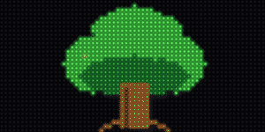{ width="240" }<figcaption>`TwinkleAnimator` — fireflies twinkle over the leaves</figcaption></figure>
<figure markdown="span">{ width="240" }<figcaption>`MotionAnimator` — the whole tile flies across and off</figcaption></figure>
<figure markdown="span">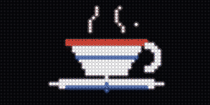{ width="240" }<figcaption>`EmitterAnimator` — steam drifts up from the cup</figcaption></figure>
<figure markdown="span">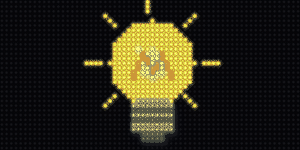{ width="240" }<figcaption>`PalettePulseAnimator` — the filament breathes brighter and dimmer</figcaption></figure>
<figure markdown="span">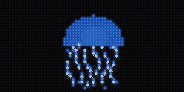{ width="240" }<figcaption>`RegionShiftAnimator` — the tentacles ripple (a per-column wave)</figcaption></figure>
<figure markdown="span">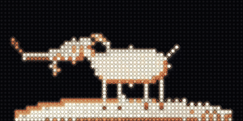{ width="240" }<figcaption>`RegionRotateAnimator` — the goat tilts its head (a true rotation about the neck)</figcaption></figure>
<figure markdown="span">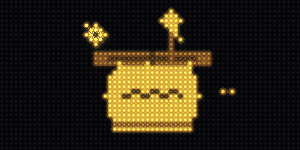{ width="240" }<figcaption>`OrbiterAnimator` — a bee loops around the honey pot</figcaption></figure>
<figure markdown="span">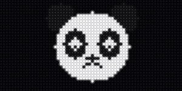{ width="240" }<figcaption>`BlinkAnimator` — the eyes blink shut and open</figcaption></figure>
<figure markdown="span">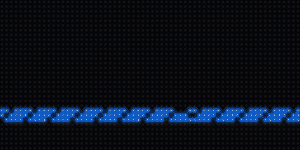{ width="240" }<figcaption>`SpriteLiftAnimator` — the canoe crosses; the water stays put</figcaption></figure>
<figure markdown="span">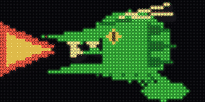{ width="240" }<figcaption>`CoverAnimator` — the mouth reads shut until it snaps open</figcaption></figure>
<figure markdown="span">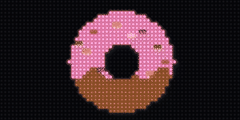{ width="240" }<figcaption>`VanishAnimator` — a bite is taken out, and stays bitten</figcaption></figure>
<figure markdown="span">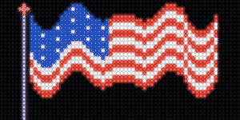{ width="240" }<figcaption>`FrameCycleAnimator` — the whole flag waves (pre-baked frames)</figcaption></figure>
<figure markdown="span">{ width="240" }<figcaption>`CelWalkAnimator` — the ostrich strides across, legs stepping (authored multi-pose cel walk)</figcaption></figure>
<figure markdown="span">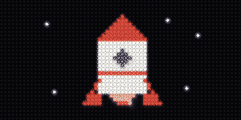{ width="240" }<figcaption>`ComboAnimator` — rise + exhaust emitter, composed</figcaption></figure>
</div>

Every animator follows the same standalone **start / step / detach** convention. Any
exception out of `start()`/`step()` is the host's cue to fall back to the still image,
so animators stay safe to `detach()` after a failure:

```python
from scrollkit.display.unified import displayio
from scrollkit.effects.image_animators import TwinkleAnimator, read_indexed_bmp

# Load once. OnDiskBitmap supplies the palette; read_indexed_bmp decodes the pixels
# into a real Bitmap — OnDiskBitmap is NOT subscriptable on CircuitPython, and most
# animators read/rewrite image pixels. The same two calls run on device and simulator.
odb = displayio.OnDiskBitmap("/logo.bmp")
palette = odb.pixel_shader
palette.make_transparent(0)                          # slot 0 = transparent "sky"
bitmap = read_indexed_bmp(display.gfx, "/logo.bmp")  # subscriptable + writable
tile = displayio.TileGrid(bitmap, pixel_shader=palette)
display.add_layer(tile)                              # the image on its own layer

anim = TwinkleAnimator(count=20)
anim.start(display, tile, bitmap, palette, base_colors)  # raise -> fall back to the still image
for frame in range(anim.HOLD_FRAMES):                # step + show once per displayed frame
    anim.step(frame)
    await display.show()
anim.detach()                                        # settle to a rest pose + free layers
display.remove_layer(tile)
```

`base_colors` is the palette's original colors as 0xRRGGBB ints, captured **before** any
fading or mutation (the demo has the one cross-platform capture helper). `read_indexed_bmp`
returns a **writable** Bitmap, so animators that rewrite pixels (`wants_writable_bitmap =
True`) need nothing extra; `copy_to_writable()` is the alternative when you already hold a
readable Bitmap. Each class advertises `HOLD_FRAMES` (how many frames one play wants, ~20 fps).

!!! tip "Runnable example — `demos/medium/image_intro.py`"
    Because an animator is `step()`-ed once per displayed frame, it lives in a
    **self-driving** app (like the splash demos): `setup()` runs the loop itself
    instead of returning and letting the [content queue](app.md) drive frames. The
    demo loads a BMP as a layer, runs the start → step-every-frame → detach contract
    for one animated intro, then hands off to a data screen — and loops through three
    of them. Run it live: `PYTHONPATH=src python demos/medium/image_intro.py`.

!!! tip "Runnable example — `demos/medium/walking_ostrich.py`"
    A **cel walk** is the one animator that plays *authored* frames rather than
    deforming the loaded bitmap: `CelWalkAnimator` cycles distinct drawn leg poses (a
    real walk cycle) while the whole sprite strides across, so the ostrich walks in from
    the left and off the right. It can also pre-bake a small rotating head/neck region
    (`head_box`, `head_pivot`, and `head_amp_deg`) to add a nod without per-frame pixel
    work. The frames live in a **sibling spritesheet** next to the
    still — `ostrich.bmp` pairs with `ostrich_walk.bmp` (four 64×32 poses in one strip,
    one palette, sky at slot 0). Because it finds that sheet from the image path, a cel
    walk is the one animator that needs the path set — `animator.image_path = path`
    (the app injects it via `for_image`; the demo sets it by hand). Drop a
    `<name>_walk.bmp` beside any `<name>.bmp` and the same animator walks it. Run it
    live: `PYTHONPATH=src python demos/medium/walking_ostrich.py`.

The fourteen animators use four motion substrates and compose with `ComboAnimator`
(e.g. a rocket is `MotionAnimator(path="rise")` + an exhaust `EmitterAnimator`):

| Substrate | Animators | What it does |
|-----------|-----------|--------------|
| **Transparent overlay** above the image (sparse writes cleared by one C `fill`) | `TwinkleAnimator`, `EmitterAnimator`, `OrbiterAnimator`, `BlinkAnimator`, `CoverAnimator` | shimmer, drifting particles, an orbiting sprite, a wink/flicker, a masked-until-cue patch |
| **Move a tile** — the image's own `TileGrid` or a lifted copy of its subject | `MotionAnimator`, `SpriteLiftAnimator` | traverse / rise / bob / jiggle; or lift a subject onto its own layer and cross a fixed scene (the hole row-inpaints) |
| **Rewrite the loaded Bitmap** or palette entries | `RegionShiftAnimator`, `RegionRotateAnimator`, `VanishAnimator`, `FrameCycleAnimator`, `PalettePulseAnimator` | wing/flag/jaw motion (sine/ramp/ripple/hinge waves), a true region rotation about a pivot (a head nodding — `exclude` keeps the attached body static), staged erases (a bite), pre-baked ripple frames, a breathing glow |
| **Play authored cels** — a tile-indexed sibling spritesheet | `CelWalkAnimator` | swap between distinct authored frames (a true walk cycle) while striding across; frames live in a `<name>_walk.bmp` strip, O(1) per frame (a tile index + an `x` write) |

Like the showcase effects, every animator carries a `FEASIBILITY` dict on the **class**
(`hardware_safe`, `allocates_per_frame`, `max_pixel_writes_per_frame`,
`modeled_frame_ms`) — bounded, bulk writes only, budgeted against the calibrated
MatrixPortal S3 model. Verify a composition with `run_headless(app, strict=True)`, which
raises `FeasibilityError` on anything that busts the ~50 ms / 20 fps budget.

## Pairing effects to content

Some effects read best on **static** (held) text, some on **scrolling** text, and
the transitions are **full-screen** swaps between content. Each effect class carries
a `PAIRS_WITH` tag (`"static"` / `"scrolling"` / `"fullscreen"`) that
`scrollkit.dev.capabilities()` surfaces as `pairs_with` (and `as_text()` prints as
`[best on: …]`), so app authors and AI agents can pick the right effect for the
content.

| Best on | Effects |
|---------|---------|
| **Scrolling** text | `KineticMarquee`, `WaveRider` — Class 1, they *are* the scroll |
| **Static** / held text | `SplitFlap` (flips characters in place) |
| **Either** static or scrolling | the `BitmapText` palette effects: `RainbowChase`, `MonoChase`, `NeonTubeCrawl`, `ChromeSheen`, `HazardStripes` |
| **Full screen** (swap between content) | every `Transition` — they all work over any content: `IrisSnap`, `VenetianShutters`, `MosaicResolve`, `CRTCollapse`, `LightSlitRewrite`, `PixelDissolve`, `ColumnRain`, `GradualReveal`, `ScanFold`, `HorizontalWipe`, `GlitchBars`, `DiagonalWipe`, `DropFromSky` |

The tag is guidance, not a constraint — nothing stops you using an effect
elsewhere; it just records what looks good.

### One call per category

You rarely need the tags by hand. Each category exposes **one selector function** that
reads the live `PAIRS_WITH` tags and returns what's available for a given presentation,
so a newly-added effect shows up automatically — no list to keep in sync:

```python
from scrollkit.effects.transitions import transitions_for
from scrollkit.effects.scrolling import scrollers_for
from scrollkit.display.bitmap_text import palette_effects_for, BitmapText
import random

transitions_for()                 # transition NAMES (all full-screen; for transition_style)
scrollers_for("scrolling")        # scroller CLASSES suited to scrolling text
palette_effects_for("scrolling")  # palette-effect CLASSES for BitmapText
```

Pass `"scrolling"` or `"static"` to `scrollers_for` / `palette_effects_for` to pick by
how the content is presented. `transitions_for` takes `presentation="fullscreen"`
(its default) — transitions are all full-screen swaps, so it returns every transition.
Apply each by its category — they are **not** interchangeable:

```python
# a transition fires BETWEEN screens — it's a setting:
app.settings.set("transition_style", random.choice(transitions_for()))
# a scroller IS the content — add the class to the queue:
cls = random.choice(scrollers_for("scrolling"))
app.content_queue.add(cls("Space Mountain  45 min", y=12))
# a palette effect goes ON bitmap text:
pe = random.choice(palette_effects_for("scrolling"))
app.content_queue.add(BitmapText("OPEN", palette_effect=pe()))
```

!!! tip "Memory ladder"
    Effects are the first thing to disable on a memory-starved device. Prefer the
    lighter transitions and keep splash/particle counts low when targeting the
    MatrixPortal S3.

## Showcase foundation primitives

The *ScrollKit Showcase Effects* work adds a small set of shared, zero-allocation
primitives that the new effects build on. Each runs **unchanged** on the device
and the simulator, and is budgeted against the calibrated MatrixPortal S3 model
(~20 fps / 50 ms per frame at `bit_depth=4`).

| Primitive | What it gives you | Hardware budget framing |
|-----------|-------------------|-------------------------|
| `scrollkit.effects.easing` | Integer easing/tween lookup tables (`ease`, `interp`) for 6 curves | Pure `bytes` lookups — no floats, no per-call allocation |
| `display.fill_rect` / `fill_span` / `clear_rect` | Bounded span/rect painters | C bulk ops (`bitmaptools.fill_region`) — never a full 2048-pixel Python loop |
| `display.measure_text(text)` | Real rendered text width (summed glyph advances) | Replaces the old `len(text) * 6` estimate; measured once, off the hot path |
| `display.gfx` + `add_layer` / `remove_layer` | Platform-resolved `Bitmap`/`Palette`/`TileGrid`/`bitmaptools`, plus a content/layer group split | Cached once per display; persistent effect layers keep a stable z-order across the per-frame clear |
| `scrollkit.effects.overlay.OverlayMask` | One preallocated indexed mask (transparent index 0) composited above content | Allocate once; transitions write only dirty spans |
| `scrollkit.effects.scrolling` | [Characterful scrolling](scrolling.md): `KineticMarquee`, `WaveRider`, `SplitFlap` | One / a few small Labels repositioned per frame; bounded rebuilds |
| `scrollkit.effects.transitions` | [Theatrical transitions](transitions.md): 13 in all — `IrisSnap`, `VenetianShutters`, `MosaicResolve`, `CRTCollapse`, `LightSlitRewrite`, `PixelDissolve`, `ColumnRain`, `GradualReveal`, `ScanFold`, `HorizontalWipe`, `GlitchBars`, `DiagonalWipe`, `DropFromSky` | Bounded mask spans per frame; swaps content while fully covered |
| `scrollkit.display.bitmap_text` | [Palette-animated bitmap text](bitmap-text.md): `BitmapText` + `RainbowChase`/`MonoChase`/`NeonTubeCrawl`/`ChromeSheen`/`HazardStripes` | Animation is a few palette writes per frame — zero per-frame pixel work, no glyph rebuild |

Every showcase effect carries an advertised `FEASIBILITY` dict (`hardware_safe`,
`allocates_per_frame`, `max_pixel_writes_per_frame`, `modeled_frame_ms`); see the
per-class pages above.

### Strict feasibility gate

Hardware simulation can run in **strict** mode: an effect whose modeled per-frame
cost busts the device budget raises `scrollkit.exceptions.FeasibilityError` instead
of only warning. The gate is steady-state (a rolling median holds ~20 fps) plus a
single-frame transient ceiling, so a legitimate one-off glyph rebuild is tolerated
while a *sustained* over-budget effect fails.

```python
from scrollkit.dev import run_headless

# strict=True implies hardware modeling; a busting effect -> result.ok is False
result = run_headless(MyApp(), frames=120, hardware=True, strict=True)
assert result.ok and result.advanced       # rendered, animated, within budget
print(result.hardware_text)                 # per-frame budget breakdown
```

Strict mode is opt-in (`strict=True`, or `SCROLLKIT_HW_STRICT=1`); it is a
desktop-simulator concept and a no-op on CircuitPython, where the device runs at
real speed.

For the measured costs behind the budget (C bulk calls vs interpreted Python, the
refresh floor, and the swarm rewrite that motivated all of this), see the
[Performance](performance.md) guide.

## Swirl entrance (0.9.0)

`SwirlIn` spirals a set of positioned sprites in around a center point,
each entering far offscreen and unwinding onto its exact target — a word
assembling as a rotating spiral. It takes a per-sprite target list, so it
is deliberately **not** a named Transition (nothing content-agnostic could
construct it):

```python
from scrollkit.effects.swirl_in import SwirlIn

entries = [(tile, x, y, w, h) for tile, x, y, w, h in my_sprites]
sw = SwirlIn(entries)                     # center, radius, stagger tunable
while not sw.is_complete:
    sw.step()
    await display.show()
```

{ width="300" }

## Swarm true-color and reverse modes (0.9.0)

`SwarmReveal` can now assemble an arbitrary source image's exact colors —
pass `pixel_colors={(x, y): 0xRRGGBB}` (the palette is derived for you) or
`text_colors=` + `index_map={(x, y): ramp_index}` for explicit control.
And `reverse=True` runs the deconstruction: the image starts fully lit and
each bird CARRIES ITS PIXEL AWAY, leaving darkness when the flock disperses.

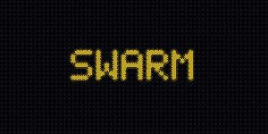{ width="300" }
