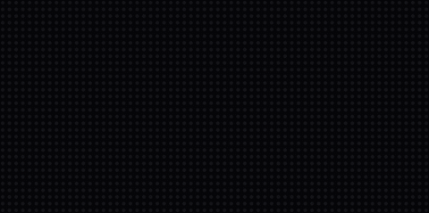

# Gradient Text

By default the text classes draw in **one flat colour** — a displayio `Label` is
physically a single-colour bitmap. Pass a **`palette`** to `StaticText` or
`ScrollingText` and the text is filled with a gradient instead, in the **same
font** your normal text already uses. It's a subtle way to add depth and interest
without it looking garish.

```python
from scrollkit.display.content import ScrollingText
from scrollkit.display.colors import depth_palette

# One base colour + a subtlety knob -> a tasteful close ramp ("lit from above"):
ScrollingText("DEPARTURES", y=12, palette=depth_palette(0x66CCFF, strength=0.45))
```

{ width="480" }

When `palette` is set, the flat `color` is ignored. With `palette=None` (the
default) nothing changes — you get the original fast single-colour path,
untouched.

## The three forms

```python
from scrollkit.display.content import StaticText, ScrollingText
from scrollkit.display.colors import depth_palette, multi_gradient

# 1) Two colours: a straight gradient from the first to the second.
StaticText("ON TIME", x=8, y=12, palette=(0xA0FFC0, 0x205038))

# 2) Several stops: a multi-stop gradient across the phrase.
ScrollingText("SCROLLKIT", y=12, direction="horizontal",
              palette=multi_gradient((0x102840, 0x2060A0, 0x66CCFF), 12))

# 3) One colour: depth_palette() derives the close second shade for you.
ScrollingText("NEXT TRAIN", y=12, palette=depth_palette(0x66CCFF))
```

`depth_palette(color, strength=0.4)` (in `scrollkit.display.colors`) returns
`(color, darker_shade)` — the highlight you pass and a shadow scaled down by
`strength`. It's a colour **transform**, not a named palette, so it fits the
library's "generate any colour, name none" philosophy. For full control, build a
ramp yourself with `gradient`, `multi_gradient`, `hsv`, or `spectrum` (see
[Colours](#colours-no-named-palettes)).

## Direction

`direction` chooses the axis the ramp runs along — the same vocabulary
`SwarmReveal` uses:

| `direction` | Ramp runs | Reads as |
|-------------|-----------|----------|
| `"vertical"` (default) | top → bottom | depth / "lit from above" — the subtle win |
| `"horizontal"` | left → right across the whole phrase | a colour sweep / decoration |
| `"diagonal"` | top-left → bottom-right | something between the two |

To **reverse** a direction, reverse the `palette` tuple (e.g.
`palette=(shadow, highlight)`) — there is no `"vertical_reverse"` name on purpose.

`palette_steps` (default `8`) sets how many ramp colours are generated from the
stops; it's clamped to `2..15` so the indexed bitmap stays at 4 bits/pixel.

!!! tip "Vertical is the depth look"
    For "depth and interest without being garish", reach for `direction="vertical"`
    with two **close** colours (or just `depth_palette`). A top-light → bottom-dark
    shade makes flat 7-pixel-tall text read as if it has dimension. Horizontal and
    multi-hue ramps are more decorative.

## It scrolls with the letters

A gradient `ScrollingText` scrolls exactly like a flat one — and it's actually
*cheaper* per frame. The glyphs are rasterised **once** into an indexed `Bitmap`
whose every lit pixel carries a palette index for its position; the text then
scrolls by moving a `TileGrid` (**zero per-frame pixel writes**, no glyph rebuild).

Because the colour is baked into each pixel's position **within the text**, the
gradient is *locked to the letters* and travels with them — a vertical shade stays
attached to each glyph as it scrolls by. (If you instead want a fixed on-screen
sheen the letters pass *through*, that's the animated path — see below.)

## Static fill vs. animated palette

Gradient text is a **static fill**. For text whose colours *move* — a rainbow
chase, a metallic sheen sweeping across — use
[`BitmapText` + a `palette_effect`](bitmap-text.md), which animates the palette
each frame. The two are deliberately separate concepts:

| | Gradient `StaticText` / `ScrollingText` | `BitmapText` + `palette_effect` |
|---|---|---|
| Colour | **static** ramp, locked to the letters | **animated** each frame |
| Font | your normal display font (terminalio) | the ScrollKit 5×7 block font |
| Use it for | subtle depth, tasteful two-tone | rainbow chase, neon, chrome sheen |

## Colours (no named palettes)

The colour helpers in `scrollkit.display.colors` are continuous generators — sample
the full 24-bit space at whatever resolution you want, rather than picking from a
fixed list:

```python
from scrollkit.display.colors import gradient, multi_gradient, hsv, spectrum, scale

gradient(0x102840, 0x00CCFF, 8)                       # deep blue -> cyan, 8 steps
multi_gradient((0x330000, 0xFF4400, 0xFFF0A0), 12)    # a fire ramp
depth_palette(0xFFE08A, strength=0.5)                 # warm amber with depth
```

## A note on the 4-bit panel (banding)

At the default `bit_depth=4` the MatrixPortal S3 panel is **RGB444** — 16 levels
per channel. A gradient between two *very* close colours can collapse to one or two
visible steps on the real panel, and a vertical gradient over a ~7-pixel-tall glyph
only has ~7 rows to work with. The **simulator previews finer (RGB565)** than the
panel shows, so a gradient that looks silky on the desktop can band on hardware.

Practical guidance:

- For *visible-but-subtle*, let at least one channel move by **~`0x20` or more**.
- **Brightness** ramps (what `depth_palette` produces) survive RGB444 better than
  tiny hue shifts.
- Don't raise `bit_depth` to 6 just for smoother gradients — it roughly **triples**
  the refresh cost.

## Feasibility

Both `StaticText` and `ScrollingText` carry a `FEASIBILITY` budget reporting
**zero per-frame pixel writes** and no per-frame allocation (the rasterise +
index-map is paid once, on the first frame). Verify any app with
`run_headless(app, strict=True)` from `scrollkit.dev`.
