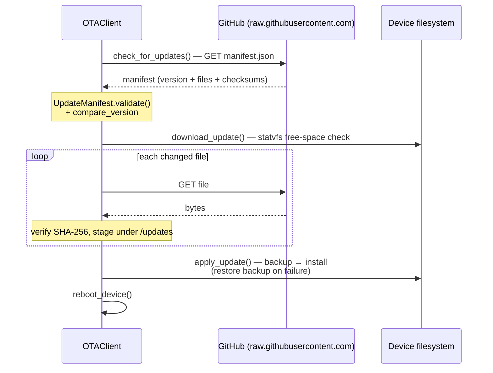

# OTA Updates

`scrollkit.ota` delivers over-the-air firmware updates from GitHub using a
manifest, with checksums and a recovery guarantee.

## How it works

<!-- Source: ota/client.py (check_for_updates/download_update/apply_update), ota/display_progress.py -->


`OTAProgressDisplay` (in `ota.display_progress`) wraps this with on-panel status
and two lifecycle hooks: `install_pending()` runs **on boot, before the display
loop starts** (applies a staged update, then reboots), and `schedule_update()`
runs **from a web route** (checks + downloads to the staging dir; the caller
must then reboot — the applied update runs after `install_pending()` picks it
up on the next boot). Both keep the blocking work off the running display loop.

```python
from scrollkit.ota.client import OTAClient

ota = OTAClient.for_github(
    owner="OWNER", repo="REPO", branch="live",
    current_version="1.0.0",
)
has_update, manifest = ota.check_for_updates()
if has_update:
    ota.download_update(manifest)
    ota.apply_update()   # does not reboot on its own — see below
    ota.reboot_device()  # reboot to run the newly-installed code
```

## Fixed branch, version in the manifest

`OTAClient.for_github(owner, repo, branch, current_version)` builds **one fixed
base URL** — `https://raw.githubusercontent.com/{owner}/{repo}/{branch}` — and
only ever reads from it:

- It fetches `manifest.json` **from that single branch**. It does **not** discover
  or enumerate branches, list tags, or call the GitHub API — see
  [Why branch selection stays off the device](#why-branch-selection-stays-off-the-device).
- "Is there an update?" is decided purely by comparing the manifest's `version`
  to `current_version`. A newer version means update; nothing else is consulted.
- Each listed file is downloaded from `{base}/files/{device-path}` and verified
  by SHA-256 + size before install.

So choosing *which* release a device runs is done by controlling **what
`manifest.json` on that one branch says** — not by pointing the device somewhere
new. That branch is the device's *channel*.

## The cheap check: `check_url` (0.9.2)

`check_for_updates()` against raw.githubusercontent has a hidden cost: that
host serves an **RSA-2048 certificate chain**, and mbedTLS verifies RSA with
multi-kilobyte allocations from the ESP32-S3's ~320 KB internal SRAM — which a
running app may not have free. The failure is `OSError: -16256`
(`-0x3F80 PK_ALLOC_FAILED`), it hits the *check* — the thing you do hourly —
and no amount of GC-heap headroom fixes it, because PSRAM can't back TLS.

`check_url` splits the problem: publish a ~6-byte `version.txt` on a host you
control with a lightweight **ECDSA** chain (a stock Let's Encrypt cert is
one), and point the check at it:

```python
ota = OTAClient.for_github(
    owner="OWNER", repo="REPO", branch="live",
    current_version="1.0.0",
    check_url="https://example.com/ota/version.txt",
)
```

With `check_url` set, a check **never handshakes with the download host**: an
up-to-date answer costs one tiny ECDSA GET, and a newer version returns a
version-only result whose manifest is fetched at **download time** — which
your app should run at early boot (before it allocates its runtime state),
where the RSA handshake has maximal internal-SRAM headroom. The publish flow
must keep `version.txt` in lockstep with the channel's `manifest.json`; make
a stale check endpoint fail your release script loudly, because a device that
reads an old `version.txt` silently believes it is up to date.

## Publishing a release (desktop / CI)

`scrollkit.ota.publish` is the library-blessed producer side — use it instead of
hand-rolling a manifest script. It is **desktop/CI only** (it shells out to
`git` and raises `ImportError` on CircuitPython).

```python
from scrollkit.ota.publish import build_manifest, publish_to_branch

# 1. Walk a source tree -> manifest.json + a files/ mirror, with per-file
#    size + SHA-256. Keys are absolute on-device paths under device_root.
build_manifest("src/", "build/ota", device_root="/src", version="1.4.0")

# 2. Replace the channel branch's contents with that payload (a single fresh,
#    parentless commit) and force-push it. Devices read this branch.
publish_to_branch("build/ota", repo_path=".", channel_branch="live",
                  commit_message="Publish OTA 1.4.0")
```

`build_manifest` never publishes secrets or machine-local state: `secrets.py`,
`settings.json`, `logs/error_log`, `__pycache__`, `*.pyc`, `.git`, and
`credentials` are always excluded (extend with `extra_excludes=`).

The same thing from the command line:

```bash
python -m scrollkit.ota.publish src/ --version 1.4.0 --root /src --channel live --repo .
# add --dry-run to print the git commands (and stage the payload) without pushing
```

`publish_to_branch(..., dry_run=True)` (and `--dry-run`) is the CI-friendly mode:
it stages the payload and **prints the exact git commands** for a workflow to run,
without touching any git state itself. It's pure git — no GitHub API, no tokens.

## Recommended release model

A single public repo serves both development and releases, using a **hybrid** of
immutable archives and one mutable channel the device tracks:

| Ref | Mutability | Who reads it |
|-----|-----------|--------------|
| `release-MAJOR.MINOR` branch (or a tag) | **immutable** archive of a cut release | humans, CI, `git` history |
| `live` channel branch | **overwritten** on each publish (force-push) | the **device**, over `raw.githubusercontent.com` |

The flow: a maintainer cuts a release by creating a `release-1.4` branch (or
pushing a tag); CI runs `scrollkit.ota.publish` to generate the payload and
publish it to the `live` channel branch; devices pointed at `branch="live"` see
the new `version` in `manifest.json` and update. The channel name is configurable
(`--channel` / `channel_branch=`) — `live` is just the default, chosen to avoid
confusion with the `release-*` archive branches. CI/script is the bridge between
the immutable archives and the channel.

## Shipping compiled `.mpy` (and what the updater will not do)

Ship scrollkit inside your payload as **`.mpy`, compiled at publish time** —
roughly half the bytes of `.py` source. On a thin flash that halving matters
twice: resident footprint, and every future delta (the free-space guard below
is sized off the delta). The payload key space is your app's policy; the
reference app publishes the library under `/lib/scrollkit/**` so an app+library
release lands atomically.

Three hard-won rules:

- **Use the mpy-cross that Adafruit builds from CircuitPython.** The
  `mpy-cross` package on PyPI is **MicroPython's** compiler — its bytecode
  (magic byte `'M'`) is rejected by CircuitPython boards (magic `'C'`) with
  `ValueError: incompatible .mpy file`. Download the binary matching the
  fleet's CircuitPython version from
  <https://adafruit-circuit-python.s3.amazonaws.com/index.html?prefix=bin/mpy-cross/>
  and **pin it (URL + sha256) in your publish script**. The `.mpy` format is
  stable within a CircuitPython major family (9.x/10.x share one); moving the
  fleet past a major means bumping the pin and re-publishing.
- **Make builds deterministic with `-s`.** mpy-cross embeds the source path it
  was given into the bytecode (for tracebacks). Compiling in a temp dir without
  `-s` gives every build unique bytes → every manifest checksum churns → the
  device re-downloads the whole library on every release even when nothing
  changed. Pass a stable name, ideally the on-device path:
  `mpy-cross -s lib/scrollkit/effects/particles.py particles.py -o particles.mpy`.
- **Keep `.py` for development.** Source on the board gives real line numbers
  in tracebacks; compile only what you publish (and for USB work, an opt-in
  `MPY=1` deploy mode keeps dev and release layouts one flag apart).

**Free space:** before staging, the client requires
`2 × (bytes of changed files) + 50 KiB` free on the device — the staged copy
plus the backup of overwritten files. Deltas, not total manifest size, are
what must fit.

**The updater never deletes by omission.** A file present on the device but
absent from the new manifest is left in place — the manifest is purely an
install-set (deleting on omission would make a torn manifest destructive).
Consequences to plan around: renaming a device file across releases orphans
the old name; switching a module `.py` ↔ `.mpy` leaves both on flash, and
**CircuitPython imports the `.mpy` when both exist**. Clean up layout changes
with a USB deploy (`rsync --delete`), a wipe-and-recopy, or an explicit
cleanup step in your app — don't expect OTA to do it.

## Why branch selection stays off the device

The device **must not** enumerate or discover branches (e.g. calling GitHub's
REST `/branches` API). Branch/version selection is a desktop/CI concern — the
device only reads one fixed channel branch. This is deliberate:

- **Rate limits.** Unauthenticated GitHub API is 60 requests/hour per IP. A
  boot-loop, or several devices behind one NAT, hits `403` and **starves
  updates** exactly when you need them. `raw.githubusercontent.com` is a CDN
  without that per-IP API budget.
- **RAM.** CircuitPython's `json.loads` needs one contiguous buffer; a growing
  `/branches` array eventually `MemoryError`s on the ~2 MB ESP32-S3 heap.
- **Latency.** The API is slower and un-CDN'd, stalling the cooperative asyncio
  display loop while it blocks.

Keep the answer to "which release?" in the published `manifest.json`, not in
on-device branch logic.

## The recovery guarantee

OTA only ever writes app/library content (`/src`, `/code.py`, and — when the
payload bundles scrollkit — `/lib/scrollkit`). **`boot.py` is frozen and never
modified by OTA.** Because the boot-time recovery anchor stays intact
regardless of any payload failure, the update system can always restore or
re-fetch a known-good version on the next boot — a bad update can't disable
the updater. Changed files are also kept as a backup so a validated-but-bad
update can be rolled back.

!!! danger "Never modify boot.py or code.py"
    The recovery design depends on `boot.py`/`code.py` staying frozen. The
    library must never write a `boot.py` supervisor of its own — the existing
    frozen one *is* the supervisor.

## On-device install UI

`OTAClient` is headless — it reports progress through callbacks but knows nothing
about a display. `scrollkit.ota.display_progress.OTAProgressDisplay` wraps an
already-configured client to add the on-panel UX and the staged-install flow, so the
client stays decoupled from the display and the update *source* stays your concern:

```python
from scrollkit.ota.client import OTAClient
from scrollkit.ota.display_progress import OTAProgressDisplay

client = OTAClient.for_github("owner", "repo", branch="live", current_version="1.0.0")
ota = OTAProgressDisplay(client, display=app.display)

# On boot, before the display loop owns the screen: apply anything staged.
await ota.install_pending()        # shows "Installing… DO NOT UNPLUG!", applies, reboots

# From a web "update" route (synchronous, safe off the display loop):
if ota.schedule_update():          # checks + downloads to the staging dir
    ...                            # then reboot; install_pending() applies it next boot
```

Status frames are stacked short lines (a 64px panel clips a long single line), and
every method swallows display/client errors rather than propagating them into the
boot/OTA flow.

## Pieces

| Module | Role |
|--------|------|
| `ota.client` | `OTAClient` — check / download / apply (auto-restores backup on install failure) / reboot_device (device) |
| `ota.manifest` | `UpdateManifest` — version, file list, checksums, requirements |
| `ota.display_progress` | `OTAProgressDisplay` — display-progress + staged-install UI over a client (device) |
| `ota.publish` | `build_manifest` / `publish_to_branch` — produce + publish a release (**desktop / CI only**) |

## No pre/post-update scripts (trust model)

Older manifests could carry `pre_update_scripts` / `post_update_scripts` —
Python snippets that the device `exec()`'d around an update. That feature has
been **removed**: the snippets ran with full device privileges from an unsigned
downloaded manifest (remote code execution for anyone who could publish to your
update URL), and no publisher ever emitted one. Updates are file swaps only.

- Manifests that still contain the (always-empty) script keys are accepted and
  the keys are silently ignored — old manifests stay compatible.
- If a future migration genuinely needs a hook (e.g. moving a settings file
  between schema versions), ship the migration as *code in the update itself*
  that runs on next boot — it is then checksummed like every other file —
  rather than reintroducing manifest-carried snippets.
