# Palette Partitions & Treatments

The cheapest device-safe animation there is: statically assign every lit
pixel of an assembled mark to one of N groups, bake that into an indexed
full-panel bitmap **once**, then animate by rewriting N palette entries
per frame — zero per-frame pixel work. On a MatrixPortal S3 a palette
write is effectively free, so a 10-band sweep costs ~10 palette writes a
frame against the 50 ms budget.

These modules were promoted from the DarkOwl LED logo sign (2026), where
every dwell effect in a 24/7 show runs on them.

## The partition

```python
from scrollkit.display.unified import displayio
from scrollkit.effects.palette_partition import PalettePartition, map_diagonal
from scrollkit.effects.reveal_splash import pixels_from_text

pixel_slots = {p: 1 for p in pixels_from_text("HELLO", x=17, y=12)}
group_map, n = map_diagonal(pixel_slots, 10)
fx = PalettePartition(displayio, pixel_slots, group_map, n)
display.add_layer(fx.tile)
fx.fill(0xB02318)          # every group one flat color
fx.tile.hidden = False
```

`pixel_slots` maps `(x, y) -> input slot`: slot 1 is the **body**
(partitioned into groups); slots 2+ are **identity pixels** — a mascot's
eyes, an accent — that take reserved palette slots which `paint()` and
`fill()` can never touch (write them via `set_identity()`, e.g. to
blink).

Partition builders (each returns `(group_map, n_groups)`):

| builder | axis | designed for |
|---|---|---|
| `map_diagonal` | bands along x + 2y | sweeps, eclipses, gradients |
| `map_anchor_distance` | distance from an anchor column | outward wakes |
| `map_radial` | concentric rings around a point | halos |
| `map_angle` | angular wedges around a point | sonar sweeps |
| `map_rain` | per-column staggered vertical cycle | descending rain |
| `map_checker` | interleaved parity | satin shimmer |
| `map_exposure` | which side of the stroke faces open sky | rim light |
| `map_regions` | coherent Voronoi patches | heatmaps |
| `map_topology` | endpoints / corners / junctions / runs | stroke anatomy |
| `map_route` | BFS order along glyph strokes | crawling packets |

## The treatments

Thirteen frame-driven classes animate a partition; each names its
recommended builder in its `PARTITION` attribute (`treatments_for("diagonal")`
selects by it). All take a 5-stop **theme** `(base, dim, flat, warm, hot)`
— darkest to hottest — and start/end painting `flat`, so an invisible
tile swap in and out is seamless.

| Class | Partition | Motion |
|-------|-----------|--------|
| `VelvetSweep` | `diagonal` | 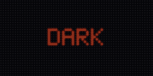{ width="300" }<br>A hot sheen travels diagonally across the dimmed mark, like light over velvet. |
| `AnchorWake` | `anchor` | 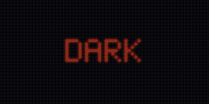{ width="300" }<br>Warmth flows outward from the anchor through the mark, and a dimmer echo returns. |
| `HaloPulse` | `radial` | { width="300" }<br>Circular pressure waves expand outward through radial bands. |
| `SonarSweep` | `angle` | 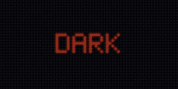{ width="300" }<br>A wedge sweeps around the anchor, leaving a fading afterglow. |
| `CipherRain` | `rain` | 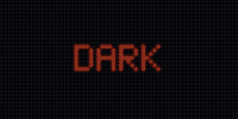{ width="300" }<br>Phase-staggered highlights descend within the strokes, column by column. |
| `InkShimmer` | `checker` | 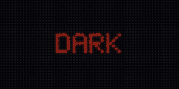{ width="300" }<br>Interleaved groups slowly exchange two close shades — a satin shimmer, quiet enough for long dwells. |
| `RimLight` | `exposure` | 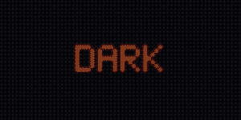{ width="300" }<br>A light source passes over; whichever stroke edge faces it catches a pale highlight. |
| `HeatmapDrift` | `regions` | 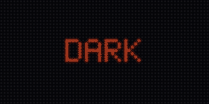{ width="300" }<br>Coherent regions warm and cool independently, like detections surfacing on a map. |
| `EclipseCross` | `diagonal` | 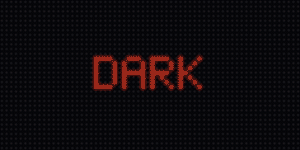{ width="300" }<br>A deep shadow crosses the flat mark with a hot corona at its leading edge and a dusk trail behind. |
| `GradientDwell` | `diagonal` | { width="300" }<br>The mark crossfades to a two-stop gradient edition, dwells, and returns to flat. |
| `StrokeAnatomy` | `topology` | 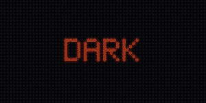{ width="300" }<br>Endpoints, corners, junctions, and runs trade emphasis in turn: the typography under analysis. |
| `RouteCircuit` | `route` | 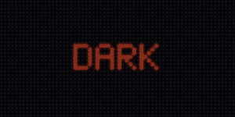{ width="300" }<br>Hot packets crawl the route sections from both ends and converge on the terminus, which flares. |
| `PacketTrace` | `route` | 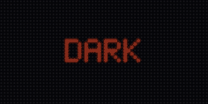{ width="300" }<br>Packet dots crawl the actual strokes toward the terminus while sections glow in their wake. The one treatment that owns display sprites — call `start(display)` / `detach()` around it. |

The caller owns pacing **and blinks**: after each `step()`, `blink_now`
is True on the exact frames the choreography wants an identity blink:

```python
from scrollkit.effects.palette_treatments import VelvetSweep

theme = (0x70140E, 0x8F1B12, 0xB02318, 0xC93A1E, 0xE65A28)
t = VelvetSweep(fx, theme)
while not t.is_complete:
    t.step()
    if t.blink_now:
        await blink(fx)            # your own held-frame blink
    else:
        await display.show()
        await asyncio.sleep(0.05)
```

Every class carries a `FEASIBILITY` budget; all are palette-only
(`max_pixel_writes_per_frame: 0`).

See the Visual Reference for a rendered sample of every treatment.
