# Theatrical Transitions (Class 2)

`scrollkit.effects.transitions` provides cinematic transitions between messages,
built on the preallocated `OverlayMask`. Every transition follows the same
**cover → swap-while-hidden → reveal** sequence: the old content is covered, the
`swap_callback` runs while the screen is fully hidden (so any glyph rebuild it
triggers lands on a covered frame), then the new content is revealed. They are the
proper replacement for the removed wipe/slide effects.

!!! info "Full-screen swaps"
    Transitions cover the whole screen between content items, so they **all** pair
    with any content (`PAIRS_WITH = ("fullscreen",)`) — static or scrolling alike.
    The static-vs-scrolling distinction lives on the content effects that render the
    text (the scrollers and the bitmap-text palette effects), not on transitions.
    See [pairing effects to content](effects.md#pairing-effects-to-content).

Each writes only a **bounded** set of mask spans/blocks per frame through the C
bulk painter (`bitmaptools.fill_region`) — never a full-2048-pixel Python loop —
with no per-frame allocation, and is strict-feasible at 20 fps.

```python
from scrollkit.effects.transitions import (
    IrisSnap, VenetianShutters, MosaicResolve, CRTCollapse, LightSlitRewrite,
)

t = IrisSnap(duration_frames=8, cover_color=0x101840)
await t.start(display, swap_callback)     # swap_callback runs while fully covered
# then each frame:
await t.render(display)
if t.is_complete:
    ...
```

## The pack

There are **thirteen** built-in transitions. The **setting name** is the value the
`transition_style` setting takes (and what [`transitions_for()`](#choosing-a-transition)
returns); the **class** is what you import. The order below is the UI/dropdown order.

| Setting name | Class | Motion | Sample |
|--------------|-------|--------|--------|
| `Drop from Sky` | `DropFromSky` | New content **slides into place from an edge** — default top, or set `direction` to `"bottom"`/`"left"`/`"right"`. A slide-in *sibling*, not the cover→reveal contract (see the note below). | 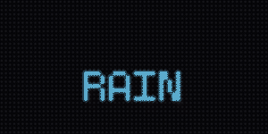{ width="180" } |
| `Pixel Dissolve` | `PixelDissolve` | Text crumbles away as random 4×4 blocks cover the screen, then the new content dissolves back in block-by-block — like film grain burning through. Works naturally over moving text. | 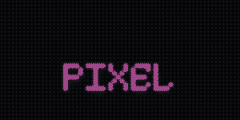{ width="180" } |
| `Column Rain` | `ColumnRain` | Sixteen thin 4 px drops fall from the top in shuffled order, so ~4 are mid-fall at any moment — reads as actual rainfall, not a directional wipe. | 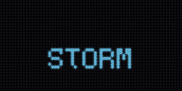{ width="180" } |
| `Gradual Reveal` | `GradualReveal` | Staggered vertical bands (default 8) wipe in left-to-right, then peel back right-to-left. Clean and architectural — not rain. | { width="180" } |
| `Scan Fold` | `ScanFold` | Top and bottom scanlines fold toward the horizontal centre until covered, then unfold outward. Two bars per frame — very fast; good on scrolling text. | 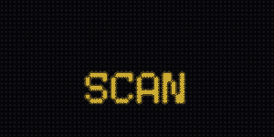{ width="180" } |
| `Horizontal Wipe` | `HorizontalWipe` | A crisp vertical edge sweeps left-to-right to cover, then back to reveal. One rect per frame; pairs well with fast-scrolling text. | 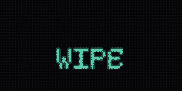{ width="180" } |
| `Glitch Bars` | `GlitchBars` | Random-height horizontal bars (1–4 rows) flash on in shuffled order — like a corrupted video signal — then clear in reverse. Looks alive over moving text. | 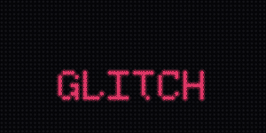{ width="180" } |
| `Diagonal Wipe` | `DiagonalWipe` | A diagonal boundary sweeps top-left → bottom-right to cover, then bottom-right → top-left to reveal. One delta span per row per frame. | 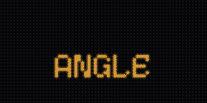{ width="180" } |
| `Iris Snap` | `IrisSnap` | A chunky diamond aperture grows to hide the screen, then a diamond hole opens to reveal it (per-row span table). | 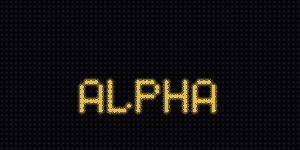{ width="180" } |
| `Venetian Shutters` | `VenetianShutters` | Coarse horizontal bands (default 8) close then open like blinds, slightly staggered. | 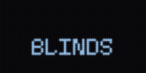{ width="180" } |
| `Mosaic Resolve` | `MosaicResolve` | Blocks (default 8×4) cover then reveal in a fixed pseudo-random order — only the newly-changed blocks are written each frame. Deterministic given `seed`. | 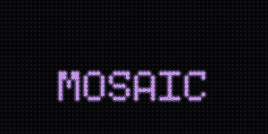{ width="180" } |
| `CRT Collapse` | `CRTCollapse` | A CRT power-off: the picture collapses to a center scanline, then blooms back open from that line. | 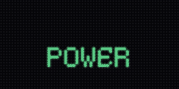{ width="180" } |
| `Light Slit` | `LightSlitRewrite` | A bright vertical scanner (default 3 px) sweeps across, covering on the way out and revealing the new content on the way back. | 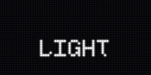{ width="180" } |

!!! note "`DropFromSky` is a duck-typed sibling, not a `Transition` subclass"
    It slides the *new* content in from an edge via a `pre_render_hook` instead of
    running the cover → swap → reveal mask lifecycle (there is nothing to hide — the
    incoming Labels are simply positioned off-screen and animated to their natural
    spot). It still exposes the same `start` / `render` / `is_complete` surface, so it
    is interchangeable everywhere the others are, and it is enumerated as a normal
    selectable transition. Pass `direction="top"` (default), `"bottom"`, `"left"`, or
    `"right"` to choose the entry edge.

## The `Transition` class family

The twelve cover→reveal transitions all subclass `Transition`, which owns the
lifecycle and a single preallocated `OverlayMask` (subclasses only implement the
two bounded `_paint_*` painters). `DropFromSky` is the odd one out: a **duck-typed
sibling** that exposes the same `start` / `render` / `is_complete` surface but
slides Labels in via `pre_render_hook` instead of covering the screen — which is
why enumeration goes through `_TRANSITION_MAP`, never `Transition.__subclasses__()`.

<!-- Source: effects/transitions.py (classes + _TRANSITION_MAP), config/transition_names.py -->
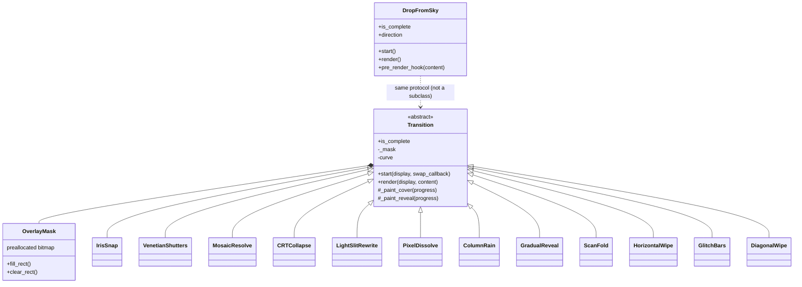

The user-facing names live in `config.transition_names.TRANSITION_NAMES`; the
name→class dispatch lives in `_TRANSITION_MAP` / `transition_factory()`. A unit
test keeps the two ordered lists in lockstep — see [below](#adding-your-own-transition).

## Choosing a transition

A transition fires **between** screens, so it is a *setting*, not content you queue.
Rather than hard-coding a class, ask the library which transitions exist and let the
setting drive dispatch — new built-ins then appear automatically:

```python
import random
from scrollkit.effects.transitions import transitions_for

# transitions_for() returns the user-facing NAMES (all transitions are full-screen
# swaps, so they all pair with "fullscreen"); pick one for the transition_style setting:
app.settings.set("transition_style", random.choice(transitions_for()))
```

`transitions_for(presentation="fullscreen")` reads the live `PAIRS_WITH` tags, so it
stays correct as transitions are added or retagged. The name → class dispatch is
`transition_factory(name)` (returns a fresh instance, or `None` for an unknown name);
`transitions_for()` / `TRANSITION_NAMES` and `_TRANSITION_MAP` are the single source of
truth, kept in lockstep by `test_transition_registry.py`. See
[pairing effects to content](effects.md#pairing-effects-to-content) for the companion
`scrollers_for()` / `palette_effects_for()` selectors.

## Using a transition between content items

`swap_callback` is the sanctioned place to swap content — it fires while the mask
fully covers the screen, so a Label rebuilt there is invisible and its cost is
absorbed by the strict gate's median window:

```python
def swap():
    self.label = next_message()   # rebuilds a Label, but it's hidden

await t.start(display, swap)
```

## Hardware budget

Each class exposes a `FEASIBILITY` dict. A full-screen cover on the 64×32 panel is
2048 px done as **one** bulk `fill_region` (~0.6 ms), not a loop.

| Effect | `max_pixel_writes_per_frame` | `modeled_frame_ms` |
|--------|------------------------------|--------------------|
| `IrisSnap` | 2048 (bulk) | ~7 |
| `VenetianShutters` | 2048 (bulk) | ~8 |
| `MosaicResolve` | ~512 (a dozen blocks) | ~6 |
| `CRTCollapse` | 2048 (bulk) | ~8 |
| `LightSlitRewrite` | 2048 (bulk) | ~8 |
| `PixelDissolve` | ~512 (block scatter) | ~6 |
| `ColumnRain` | ~256 (a few 4 px drops) | ~4 |
| `GradualReveal` | ~256 (a few bands) | ~4 |
| `ScanFold` | ~256 (two bars) | ~4 |
| `HorizontalWipe` | ~192 (one edge rect) | ~3 |
| `GlitchBars` | ~256 (a few bars) | ~5 |
| `DiagonalWipe` | ~384 (per-row delta spans) | ~6 |
| `DropFromSky` | 0 (repositions Labels, no mask writes) | ~0.5 |

All are `hardware_safe = True`, `allocates_per_frame = False`, and stay well under
the ~50 ms (20 fps) `bit_depth=4` device budget. `DropFromSky` writes no mask pixels
at all — it only nudges the incoming Labels' positions — so it is the cheapest of the
set.

See the [Performance](performance.md) guide for the full cost model these budgets
come from (the measured per-pixel and refresh costs, and why the 50 ms ceiling
exists).

## Adding your own transition

Subclass `Transition` and implement two methods — the base class runs the
cover → swap → reveal lifecycle for you. The full, heavily-annotated reference is
**`demos/medium/golden_transition.py`** (`GoldenWipe`); copy it.

{ width="480" }

The rules:

1. Implement `_paint_cover(progress)` and `_paint_reveal(progress)`, where
   `progress` is an eased `0..255` through each phase. Paint into `self._mask` (an
   `OverlayMask`) with `fill_rect` / `clear_rect` — **bounded, bulk** writes only.
   No per-pixel Python loop over the panel; no per-frame allocation.
2. Override `start(display, swap_callback)` to capture `display.width/height`, then
   `await super().start(...)`.
3. Declare a `FEASIBILITY` dict on the **class** (CircuitPython can't attach
   attributes to functions).

Then **prove it** — the safety gate is the headless feasibility harness, not a
runtime sandbox:

```python
from scrollkit.dev import run_headless
result = run_headless(my_app, frames=120, strict=True)
assert result.ok and not result.errors   # raises FeasibilityError if over budget
```

To make it a **selectable built-in** (offered in the `transition_style` setting):

1. Add the class to `_TRANSITION_MAP` in `scrollkit/effects/transitions.py`.
2. Add its user-facing name to `TRANSITION_NAMES` in
   `scrollkit/config/transition_names.py`, in the same position.

These two lists are the single source of truth for transitions; a unit test
(`test_transition_registry.py`) fails if they drift, so a selectable name can never
silently fail to dispatch, and importing the settings never drags the effects
package onto the device boot path. To use a custom transition **without** making it
a built-in, override `_get_transition()` on your app to return an instance (see the
golden demo).
