# Visual Reference

Every visual API in ScrollKit, shown in isolation on a canvas chosen to flatter the
effect — deliberately different from the themed [Demo Gallery](../demos.md), so you
can see the *effect itself*, not an app. Each sample was recorded from the desktop
simulator (`make docs-reference`) and links back to the guide that documents it.

!!! tip "See it live"
    A GIF loses the true LED look. To watch any effect in the real simulator window:
    ```bash
    python demos/render_reference.py --preview iris-snap
    ```

## Theatrical transitions

Full-screen swaps *between* content — cover the old, swap while hidden, reveal the
new. Set via the `transition_style` setting. Full details:
[Theatrical Transitions](transitions.md).

<div class="grid" markdown>

<figure markdown="span">{ width="240" }<figcaption>Drop from Sky</figcaption></figure>
<figure markdown="span">{ width="240" }<figcaption>Pixel Dissolve</figcaption></figure>
<figure markdown="span">{ width="240" }<figcaption>Column Rain</figcaption></figure>
<figure markdown="span">{ width="240" }<figcaption>Gradual Reveal</figcaption></figure>
<figure markdown="span">{ width="240" }<figcaption>Scan Fold</figcaption></figure>
<figure markdown="span">{ width="240" }<figcaption>Horizontal Wipe</figcaption></figure>
<figure markdown="span">{ width="240" }<figcaption>Glitch Bars</figcaption></figure>
<figure markdown="span">{ width="240" }<figcaption>Diagonal Wipe</figcaption></figure>
<figure markdown="span">{ width="240" }<figcaption>Iris Snap</figcaption></figure>
<figure markdown="span">{ width="240" }<figcaption>Venetian Shutters</figcaption></figure>
<figure markdown="span">{ width="240" }<figcaption>Mosaic Resolve</figcaption></figure>
<figure markdown="span">{ width="240" }<figcaption>CRT Collapse</figcaption></figure>
<figure markdown="span">{ width="240" }<figcaption>Light Slit</figcaption></figure>

</div>

## Characterful scrollers

Scrolling text with personality — mass, waves, mechanical flips. Full details:
[Characterful Scrolling](scrolling.md).

<div class="grid" markdown>

<figure markdown="span">{ width="300" }<figcaption>KineticMarquee — eases in, dwells at punctuation, springs</figcaption></figure>
<figure markdown="span">{ width="300" }<figcaption>WaveRider — characters ride a sine wave</figcaption></figure>
<figure markdown="span">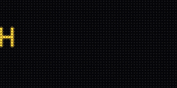{ width="300" }<figcaption>SplitFlap — flips through glyphs then lands</figcaption></figure>

</div>

## Palette-animated bitmap text

The glyphs are drawn once; the colour is animated by rewriting the palette each frame.
Full details: [Palette-Animated Bitmap Text](bitmap-text.md).

<div class="grid" markdown>

<figure markdown="span">{ width="240" }<figcaption>RainbowChase</figcaption></figure>
<figure markdown="span">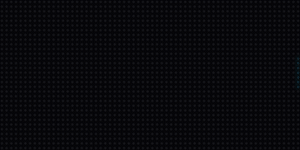{ width="240" }<figcaption>MonoChase</figcaption></figure>
<figure markdown="span">{ width="240" }<figcaption>NeonTubeCrawl</figcaption></figure>
<figure markdown="span">{ width="240" }<figcaption>ChromeSheen</figcaption></figure>
<figure markdown="span">{ width="240" }<figcaption>HazardStripes</figcaption></figure>

</div>

## Text content modes

`ScrollingText` scrolls right-to-left, or holds centred when `speed=0`. Full details:
[Display](display.md#content-types).

<div class="grid" markdown>

<figure markdown="span">{ width="300" }<figcaption>ScrollingText — scrolling</figcaption></figure>
<figure markdown="span">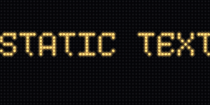{ width="300" }<figcaption>ScrollingText — static (speed=0)</figcaption></figure>

</div>

## Gradient text fill

`StaticText` / `ScrollingText` fill the letters with a static gradient along the
chosen axis. Full details: [Gradient Text](gradient-text.md).

<div class="grid" markdown>

<figure markdown="span">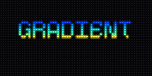{ width="240" }<figcaption>direction="vertical"</figcaption></figure>
<figure markdown="span">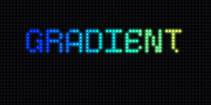{ width="240" }<figcaption>direction="horizontal"</figcaption></figure>
<figure markdown="span">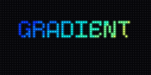{ width="240" }<figcaption>direction="diagonal"</figcaption></figure>

</div>

## Splash reveals

Setup-time reveals that assemble a word or logo. Documented in
[Effects](effects.md#splash-reveals).

<div class="grid" markdown>

<figure markdown="span">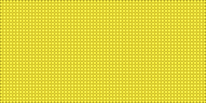{ width="240" }<figcaption>reveal — wink off non-text pixels</figcaption></figure>
<figure markdown="span">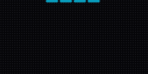{ width="240" }<figcaption>drip — pixels fall into place</figcaption></figure>
<figure markdown="span">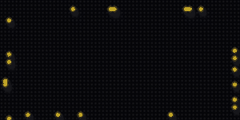{ width="240" }<figcaption>swarm — a flock assembles the image</figcaption></figure>

</div>

## Particles

Lightweight particle systems. Documented in [Effects](effects.md#particles).

<div class="grid" markdown>

<figure markdown="span">{ width="240" }<figcaption>Sparkle</figcaption></figure>
<figure markdown="span">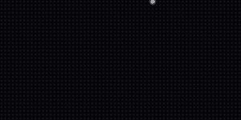{ width="240" }<figcaption>Snow</figcaption></figure>
<figure markdown="span">{ width="240" }<figcaption>Ember</figcaption></figure>

</div>

## Colour generators

Continuous 24-bit ramps sampled at any resolution — not fixed palettes. Documented in
[Utilities](utils.md#colour-generators).

<div class="grid" markdown>

<figure markdown="span">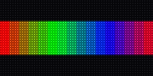{ width="300" }<figcaption>spectrum(16)</figcaption></figure>
<figure markdown="span">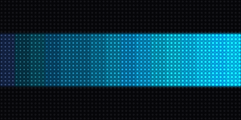{ width="300" }<figcaption>gradient(deep&nbsp;blue,&nbsp;cyan,&nbsp;16)</figcaption></figure>
<figure markdown="span">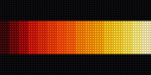{ width="300" }<figcaption>multi_gradient(fire&nbsp;stops,&nbsp;16)</figcaption></figure>
<figure markdown="span">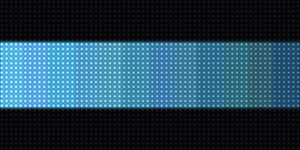{ width="300" }<figcaption>depth_palette(base,&nbsp;0.55,&nbsp;12)</figcaption></figure>
<figure markdown="span">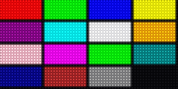{ width="300" }<figcaption>the 16 named colours</figcaption></figure>

</div>
