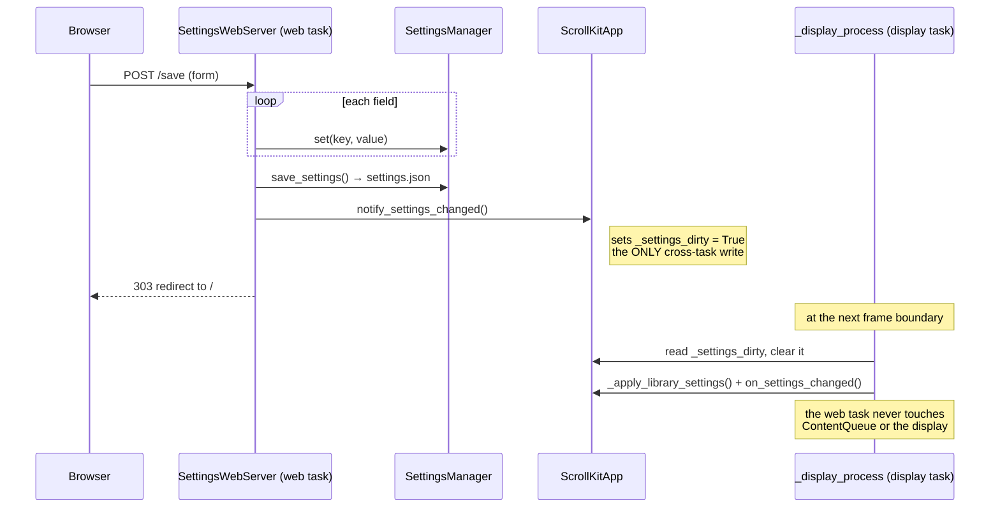

# Web Interface

`scrollkit.web` provides a configuration web server that runs on the LED device
itself. It is strictly a **configuration UI** — there is no display preview,
because the server runs on the same device that drives the panel.

## SettingsWebServer

`scrollkit.web.settings_server.SettingsWebServer` is a single server that runs on
both platforms. It builds an `adafruit_httpserver` server (imported lazily) over a
platform-appropriate socket pool:

- **CircuitPython** → `socketpool.SocketPool(wifi.radio)`, served on port 80 at the
  device's IP address
- **Desktop** → a stdlib socket, served on `localhost:8080`

The form is generated automatically from `SettingsManager._schema`, so your app
gets a config UI for free. Enable it through the app:

```python
class MyApp(ScrollKitApp):
    def __init__(self):
        super().__init__(enable_web=True)   # started when memory allows
```

Then browse to the device's IP address on your local network to change settings.

## Endpoints

The whole package is the single `scrollkit.web.settings_server` module. It exposes
two routes and implements the app's web contract — `start()`, `get_server_url()`,
`run_forever()` (polls the server each tick), `stop()`:

| Route | Method | Role |
|-------|--------|------|
| `/` | GET | render the settings form from `SettingsManager._schema` (`_render_form()`) |
| `/save` | POST | parse the form, persist via `SettingsManager`, flag the app, then redirect back |

To replace the auto-generated UI with your own server, override
`create_web_server()` on your app (return `None` to disable it).

## Thread safety: the one channel

The web server runs as its own cooperative task — never an OS thread
(CircuitPython has none). It may **write settings and set one flag**, nothing else.
On `POST /save` it persists the settings and calls `app.notify_settings_changed()`,
whose entire body is `self._settings_dirty = True`. The **display loop** owns all
display/queue mutation and applies the change at its next frame boundary. Multiple
saves that arrive before the loop runs coalesce into a single apply (settings are
re-read from disk, not queued), so no locks are needed.

<!-- Source: web/settings_server.py (_apply), app/base.py (notify_settings_changed, _apply_library_settings) -->

