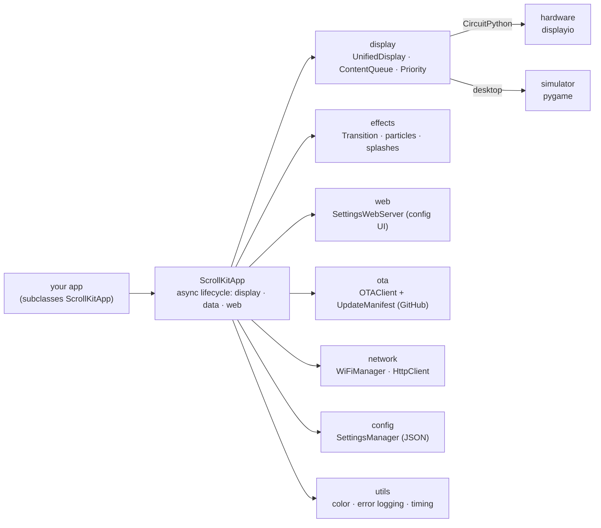

<div class="sk-hero">
  <video class="sk-hero__video" autoplay loop muted playsinline preload="auto"
         poster="assets/video/scrollkit-hero-poster.png">
    <source src="assets/video/scrollkit-hero.mp4" type="video/mp4">
    Your browser doesn't support embedded video.
  </video>
  <p class="sk-hero__caption">One 64×32 LED show: swarm-assembled, lit with sweeping sheen, and colored entirely by ScrollKit, captured from its pixel-accurate simulator.</p>
</div>

# ScrollKit

Most LED-matrix libraries get you a scrolling "Hello, World" and call it a day. I
built ScrollKit for everything after that, whether you're making a clock for your
desk or a product you'll ship to people who never open a code editor. It pushes
over-the-air updates to boards already in the field, refreshes live data on a
fault-tolerant loop that keeps scrolling when the network hiccups, and gives
users a built-in web server to change settings from their phone, all while
running transitions and effects that look deliberate. None of those features is the hard part. The hard part is running
every one of them at once, on a microcontroller with a couple hundred kilobytes of
RAM, without the display stuttering. And because none of that is fun to debug on
real hardware, I made it run unchanged in a desktop simulator that matches the
panel pixel for pixel and exports its own GIFs and videos, like the one above.

*Built by [Michael Czeiszperger](http://czei.org)*

```python
import asyncio
from scrollkit.app.base import ScrollKitApp
from scrollkit.display.content import ScrollingText

class HelloWorldApp(ScrollKitApp):
    async def setup(self):
        self.content_queue.add(
            ScrollingText("Hello, World!", y=12, color=(0, 255, 128)))

asyncio.run(HelloWorldApp().run())
```

## Why ScrollKit

- **One codebase, two targets.** A platform-detecting display layer picks the
  real `displayio` hardware backend on CircuitPython and the simulator on
  desktop. Your application code never branches on platform.
- **Board-agnostic.** On CircuitPython it auto-detects the board, starting with
  MatrixPortal S3, and falls back cleanly; adding a board is a small recipe.
  See [Adding New Hardware](guide/hardware.md).
- **Async-first.** A cooperative event loop keeps the display scrolling while
  data refreshes and the web server run as background tasks.
- **Memory-aware.** Built for the tight RAM budgets of embedded boards such as
  the MatrixPortal S3: a lightweight import surface and graduated feature
  degradation when memory is low.
- **Batteries included.** A content queue, an effects/transitions engine, a
  configuration web UI, manifest-based OTA updates from GitHub, WiFi and HTTP
  helpers, and JSON settings persistence.

## What you can build

ScrollKit is the engine behind DIY scrolling-LED projects: clocks, weather
boards, crypto/stock tickers, status displays, and bigger apps like
**ThemeParkWaits** (a live theme-park wait-time board). The library ships with
graded demos so you can see each capability in isolation:

| Demo | Shows |
|------|-------|
| [`demos/easy/`](tutorials/easy.md) | Scrolling text, no network |
| [`demos/medium/`](tutorials/medium.md) | Live temperature from a public API, periodic refresh |
| [`demos/hard/`](tutorials/hard.md) | Web config, priority queue, effects, multiple data sources, OTA, chunked fetch |

See them all running in the **[Demo Gallery](demos.md)**, animated previews of
every demo, recorded from the simulator.

## Architecture at a glance



See the **[Architecture guide](guide/architecture.md)** for the full system-context
and dependency diagrams, then head to **[Getting Started](getting-started.md)** and
work through the tutorials from easy to hard.

## How this was built

I wrote the first two shipping versions by hand in 2024, when all of this was
still one application. Splitting it into a library and a separate app layer, then
documenting the result, is the kind of project that dies quietly in a spare-time
backlog. So I used Claude Code and spec-driven development to handle the
refactoring and the first drafts, then went back through all of it in my own
voice, with my own screenshots. Yes, AI has touched a lot of this code. It was
also directed by an engineer who has shipped production software for a living,
including time on one of Sun Microsystems' API teams. Both are true.
