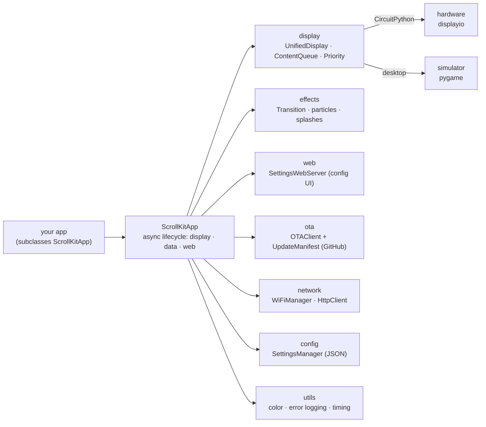

<div class="sk-hero">
  <video class="sk-hero__video" autoplay loop muted playsinline preload="auto"
         poster="assets/video/scrollkit-hero-poster.png">
    <source src="assets/video/scrollkit-hero.mp4" type="video/mp4">
    Your browser doesn't support embedded video.
  </video>
  <p class="sk-hero__caption">One 64×32 LED show: swarm-assembled, lit with sweeping sheen, and colored entirely by ScrollKit, captured from its pixel-accurate simulator.</p>
</div>

# ScrollKit

*by [Michael Czeiszperger](http://czei.org)*

Two years ago I set out to learn Python by programming a MatrixPortal S3 driving a
64×32 LED panel. I'm a product engineer, so for me, the best way of learning Python was to
ship a product: [ThemeParkWaits](https://www.themeparkwaits.com), a scrolling LED display showing ride wait times for up
to four theme parks at once.

Learning Python went fine. Shipping a CircuitPython product took a year, and almost none of that time went
where I expected it to.

CircuitPython has no real application libraries. Getting a simple demo onto the
panel meant pages of constants and setup before anything scrolled. My degree is in
Electrical and Computer Engineering, which is the discipline specifically about
programming these things, and I still found it tedious. Mostly I kept thinking about
the hobbyist who just wants a clock on their desk and has to wade through all of
that first.

The setup was the easy part. The real time went into three things every finished
product needs, and that CircuitPython gives you nothing for.

**Nobody wants to edit a text file to join WiFi.** Customers do not mount a drive on
their computer and edit a config file to set a WiFi password. The standard answer is
onboarding: the board raises its own private WiFi network, you connect to it from
your phone, and you pick your network from a list.

**CircuitPython is not multithreaded.** It has crude cooperative multitasking, and
networking is not part of it. So every time the board fetched fresh data, the whole
thing froze, display included.

I did not fix that. It is a low-level limitation of CircuitPython's HTTP library, and
fixing it properly would mean redesigning that library. What I fixed was the part that
actually hurt. The first version I shipped went black during a refresh, so a customer on
a slow connection pulling a lot of data would watch a dead panel for five minutes and
reasonably conclude the thing had broken. ScrollKit now paints a static frame before it
blocks. The board still freezes. It just freezes with a message on it, which is the
difference between a pause and a panic.

**Settings need a place to live.** Almost every app has settings a user should be
able to change without plugging the device into a computer. The obvious answer is to
host a small settings website on the board. That locks up during data updates too.

It took me, a professional, months just to work out what this board could and couldn't
do. That is the entire reason this library exists. You write the part that's actually
yours, a routine that fetches your values and hands them to the display, and ScrollKit
handles the WiFi onboarding, the settings web UI, the update scheduling, and the display
loop, including the unglamorous work of making the unavoidable pauses look deliberate.
Once the board is sitting on somebody
else's desk, it pulls its own updates over the air from a GitHub release, so a bug fix
doesn't require asking a customer to find a USB cable.

```python
import asyncio
from scrollkit.app.base import ScrollKitApp
from scrollkit.display.content import ScrollingText
from scrollkit.display.simulator import SimulatorDisplay   # desktop-only import

class HelloWorldApp(ScrollKitApp):
    async def create_display(self):
        # Open the desktop simulator window. On CircuitPython hardware, delete
        # this override (and its import); the default display drives the panel.
        return SimulatorDisplay(width=64, height=32)

    async def setup(self):
        self.content_queue.add(
            ScrollingText("Hello, World!", y=12, color=(0, 255, 128)))

asyncio.run(HelloWorldApp().run())
```

## You cannot debug code that's already on the board

At least when I started, no debugger would help you with code running on the device,
and CircuitPython does not run on your desktop. So ScrollKit ships a simulator. Your
app runs on your computer, pixel for pixel, with all the hardware details that took
me months to work out swapped in behind the same API.

The simulator also records its own GIFs and MP4s. If you have ever tried to film an
LED panel you know why that matters: the color range fools even a DSLR, and the
footage never looks like the thing sitting in front of you. The video at the top of
this page came out of the simulator, not a camera.

## Fast on your laptop means nothing

I wanted transitions, animations, playful fonts. The available libraries sat low
enough that a crude animation was a weekend project, and worse, nothing told you
which calls ran in C and which ran in Python. That distinction decides whether an
effect runs at all.

Here is the gap, measured on a real MatrixPortal S3. Filling all 2,048 pixels of the
panel with one C call takes 9 microseconds. Setting those same 2,048 pixels one at a
time from Python takes 14 milliseconds. Identical result, 1,600 times slower, and
nothing in the documentation tells you which one you just wrote.

So I wrote a program that measures 31 operations on real hardware, from integer math
to bulk bitmap fills to a full panel refresh, and folded the numbers into the
simulator. Now the desktop tells you what the panel will do. An effect that busts the
20 fps budget fails on your laptop in about a second, instead of after you flash it
and squint at a stuttering sign.

## For people who don't want to learn any of this

All of it works the same whether you're an experienced programmer, a beginner, or
someone who doesn't code at all and is pointing an AI at the problem. Blocking out a
sprite animation with AI and watching it run at true device speed a few seconds later
has saved me weeks over animating by hand.

## What's in the box

- **One codebase, two targets.** The display layer picks the real `displayio`
  backend on CircuitPython and the simulator on desktop. Your application code never
  branches on platform.
- **Board-agnostic.** It auto-detects the board on CircuitPython, starting with the
  MatrixPortal S3, and adding another is a short recipe. See
  [Adding New Hardware](guide/hardware.md).
- **Async-first, honestly.** A cooperative event loop runs the display, the data
  refresh, and the web server as separate tasks. A synchronous HTTP fetch still stalls
  all three, because that is how CircuitPython's HTTP library works, so the framework
  renders a loading frame first (`show_loading()`) instead of pretending otherwise.
- **Memory-aware.** The S3 measures about 2 MB of usable RAM, which sounds roomy
  until you're holding a frame buffer, a web server, and a JSON payload at once.
  Importing `scrollkit` pulls in nothing but a version number; every module costs RAM
  on a microcontroller, so you import only what you use.
- **Batteries included.** A content queue, transitions and effects, a configuration
  web UI, manifest-based OTA updates from GitHub, WiFi and HTTP helpers, and JSON
  settings persistence.

## What you can build

ScrollKit is the engine behind DIY scrolling-LED projects: clocks, weather boards,
crypto and stock tickers, status displays, and bigger apps like **ThemeParkWaits**,
the live wait-time board that started all of this. The library ships with graded
demos so you can see each capability on its own:

| Demo | Shows |
|------|-------|
| [`demos/easy/`](tutorials/easy.md) | Scrolling text, no network |
| [`demos/medium/`](tutorials/medium.md) | Live temperature from a public API, periodic refresh |
| [`demos/hard/`](tutorials/hard.md) | Web config, priority queue, effects, multiple data sources, OTA, chunked fetch |

See them all running in the **[Demo Gallery](demos.md)**, animated previews of every
demo, recorded from the simulator.

## Architecture at a glance


```mermaid
flowchart LR
    app["your app<br/>(subclasses ScrollKitApp)"] --> sk["ScrollKitApp<br/>async lifecycle: display · data · web"]
    sk --> display["display<br/>UnifiedDisplay · ContentQueue · Priority"]
    display -->|CircuitPython| hw["hardware<br/>displayio"]
    display -->|desktop| sim["simulator<br/>pygame"]
    sk --> effects["effects<br/>Transition · particles · splashes"]
    sk --> web["web<br/>SettingsWebServer (config UI)"]
    sk --> ota["ota<br/>OTAClient + UpdateManifest (GitHub)"]
    sk --> network["network<br/>WiFiManager · HttpClient"]
    sk --> config["config<br/>SettingsManager (JSON)"]
    sk --> utils["utils<br/>color · error logging · timing"]
```

See the **[Architecture guide](guide/architecture.md)** for the full system-context
and dependency diagrams, then head to **[Getting Started](getting-started.md)** and
work through the tutorials from easy to hard.

## How this was built

I wrote the first two shipping versions by hand in 2024, when all of this was
still one application. Splitting it into a library and a separate app layer, then
documenting the result, is the kind of project that dies quietly in a spare-time
backlog. So I used Claude Code and spec-driven development to handle the
refactoring and the first drafts, then went back through all of it in my own
voice, with my own screenshots. Yes, AI has touched a lot of this code. It was
also directed by an engineer who has shipped production software for a living,
including time on one of Sun Microsystems' API teams.
