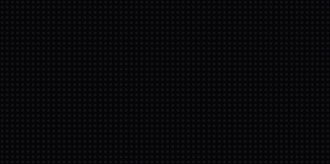
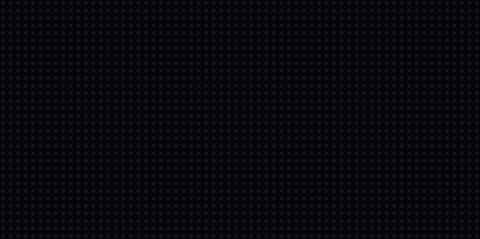
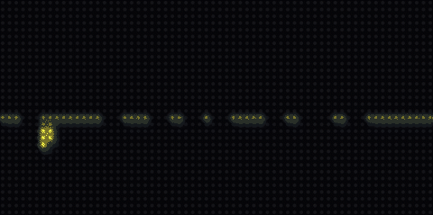
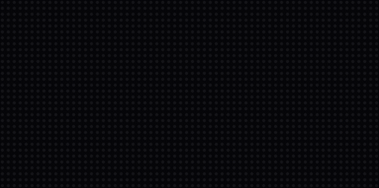

# Sample Project: The Forge Sign

<video controls playsinline preload="metadata" width="100%"
       poster="../assets/video/forge-full-cycle-poster.png">
  <source src="../assets/video/forge-full-cycle.mp4" type="video/mp4">
  Your browser doesn't support embedded video.
</video>
<p style="opacity:.7; font-size:.85em">One full cycle (4:45, true panel speed):
every act recorded straight from the simulator. The identical code drives a
64×32 HUB75 panel on a MatrixPortal S3.</p>

This is a complete, real ScrollKit application — a lobby sign for
[The Forge](https://www.forgegreensboro.org), a community makerspace in
Greensboro, NC — published here as one concept of what you can build with this
library and a $30 board. It's not a demo of a single effect; it's the whole
program: a brand wordmark rendered five different ways, animated by dozens of
build/dwell/exit acts, **alternating with little vignettes of the shops at
work** — a hammer forging the letters on an anvil, a laser cutting them out of
steel plate, a 3D printer rastering them in, a table saw, a MIG welder, a
potter's wheel, a sewing machine.

[**Download the full source** (`theforge-led-logo.zip`, 104&nbsp;KB)](assets/forge/theforge-led-logo.zip)
— three Python files plus the preview and deploy tooling. MIT-style: copy it,
gut it, reskin it.

## The best trick: the sign forges itself

Every boot opens the same way. A steel anvil drops in, a hammer strikes four
times, and each clang stamps letters of the wordmark white-hot with a ballistic
spark shower. The letters cool through pale gold to the brand yellow, and the
anvil takes the brand too.

{ width="480" }

The activities aren't interludes bolted onto a logo loop — most of them *are*
logo builds. The laser cuts the brand's knockout block out of gray plate and
the finished piece flips brand yellow:

{ width="480" }

The 3D printer rasters the wordmark bottom-up, fresh layers glowing
extrusion-hot:

{ width="480" }

And because unlit pixels are free on an LED panel, the brand's actual mark —
black letters knocked out of a yellow block — costs nothing to render and
looks terrific with palette treatments running over the field:

{ width="480" }

## How it works

The whole application is three files:

```
code.py          # device entry point: runs the 24/7 shuffle
glyphs.py        # every letter and sprite as ASCII pixel art, plus the palette
forge_logo.py    # one ScrollKitApp subclass: layouts, scenes, the scheduler
```

**Pixel art is ASCII rows.** Letters, anvils, hammers, saw blades — everything
is a list of strings, one character per LED, mapped to palette slots. Editing
art is editing text:

```python
CHAR_TO_SLOT = {".": 0, "#": 1, "o": 2, "w": 3, "s": 9, "d": 10, "b": 11}
#                transparent  yellow  ember  white  steel  iron   wood

"F": [
    "##########",
    "##########",
    "##########",
    "###.......",
    "###.......",
    "#########.",
    ...
```

**Layouts are data.** The mark composes five ways — a hero line, the knockout
block, THE-over-FORGE rows, an emblem standing on the anvil, a badge — each
just a tuple of `(glyph, x, y)` placements plus an anchor point that the
anchored effects (heat wakes, halos, packet routes) radiate from:

```python
LAYOUTS = {
    "line": {
        "glyphs": (("F", 3, 6), ("O", 15, 6), ("R", 27, 6),
                   ("G", 39, 6), ("E", 51, 6)),
        "anchor": "O",
        "anchor_point": (20, 15),   # the pilot light in the O's counter
    },
    ...
```

**Animation is palette writes, not pixel writes.** This is the core ScrollKit
discipline that makes a microcontroller keep up: every tile is built once at
startup, and almost every effect on screen is a handful of palette-slot writes
per frame. The mark glowing through a black-body heat ramp is five writes per
frame. The laser "cutting" letters dark is one write per column band, over a
bitmap whose letter pixels were pre-grouped into bands. The library's
[palette partitions and treatments](guide/palette-treatments.md) do the same
for a dozen dwell effects — sheens, wakes, blooms, shimmer — all running well
inside the 50&nbsp;ms/frame budget of a MatrixPortal S3. Under ScrollKit's
device timing model this app's 24/7 mode runs a modeled 15&nbsp;ms/frame.

**Vignette actors are sprites with poses.** The hammer is three rotation
poses swapped on an eased arc; the saw blade spins by alternating two tooth
phases; sparks are ten one-LED tiles flown along precomputed ballistic arc
tables, fading via single writes on one shared 3-color palette. No per-frame
allocation, no math on the panel.

**Variety is scheduled, not random.** The 24/7 `shuffle` strictly alternates
an abstract logo act (build → dwell treatment → exit, drawn from
family-tagged decks so nothing similar plays twice running) with a shop
activity (drawn from its own weighted deck, so the same tool never works two
turns in a row). ScrollKit's `ActScheduler` weights every pick toward whatever
has been seen least recently.

**You never need the hardware to iterate.** Every animation above was designed
against the pixel-accurate [simulator](guide/simulator.md): `preview.py`
renders any version headlessly to PNG/GIF/MP4 with the built-in recorder, and
`sprite_check.py` renders the pixel art huge for squinting at letterforms.
When it's right, `scripts/deploy.sh` rsyncs the app and library to a
USB-mounted board.

## Run it yourself

```bash
pip install "scrollkit[simulator]"
unzip theforge-led-logo.zip && cd theforge-led-logo

python3 forge_logo.py strike     # the signature act, in a simulator window
python3 forge_logo.py laser
python3 forge_logo.py shuffle    # the full 24/7 show
python3 preview.py strike        # render it to previews/strike.gif instead
```

With a MatrixPortal S3 plugged in, `scripts/deploy.sh --dry-run` shows what
would ship, and without `--dry-run` it ships it: the board boots straight into
the shuffle.

## Make one for your own logo — with AI

This entire project was built in an afternoon by describing it to an AI coding
agent (Claude Code), reviewing rendered previews, and asking for changes. The
workflow generalizes to any wordmark — your school, your business, your team —
and this sample is designed to be the reference you hand the agent.

1. **Give the agent this sample.** Point it at the unzipped
   `theforge-led-logo/` directory (it ships its `CLAUDE.md`, which teaches the
   agent the hardware constraints: prebuilt tiles, palette-write animation,
   the 20&nbsp;fps frame budget, CircuitPython's limits).
2. **Give it your identity.** Your logo image and website URL. Ask it to
   sample the exact brand colors from the image and study what your
   organization actually does — the activities are where the personality
   comes from.
3. **Name your vignettes.** A school: a pencil writing the wordmark, a
   basketball swishing through the O. A pizzeria: dough tossed, a slice
   pulled with stretching cheese. A robotics team: an arm assembling the
   letters. The bar that matters: *each one must read clearly at 64×32.*
4. **Review as renders, not code.** Have the agent render every scene as a
   GIF (the `preview.py` pattern) and look at real frames before approving.
   Ask for a review page with every animation embedded — you'll catch far
   more from pictures than from source.
5. **Then deploy.** The deploy script needs nothing but the board on USB.

A prompt that works, verbatim:

> Here is my organization's logo image and our website. Using the
> `theforge-led-logo/` project in this directory as your architectural
> reference (read its CLAUDE.md first), build me an LED sign app for a 64×32
> MatrixPortal S3 with ScrollKit: our wordmark in the exact brand colors,
> in several layouts, animated many different ways — plus short vignette
> animations of what we do: [name two or three activities]. Alternate the
> abstract logo acts with the activity vignettes in the 24/7 shuffle. Draw
> the letterforms fresh to match our logo's weight. Render a GIF preview of
> every scene so I can review them, and iterate with me until they read
> clearly at 64×32.

The economics are worth spelling out: the panel is ~$25, the MatrixPortal S3
is ~$30, and the software that used to be the hard part is now a conversation.
The constraint that remains — and the thing worth your taste — is *legibility
at 2,048 pixels*. Insist on it in every review pass.

---

*Want the deeper mechanics this sample leans on? See
[Palette Partitions &amp; Treatments](guide/palette-treatments.md),
[Effects](guide/effects.md), [Performance](guide/performance.md), and the
[Simulator](guide/simulator.md) guide.*
